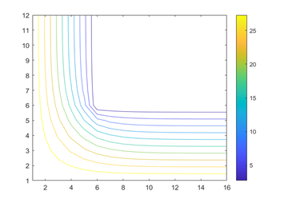
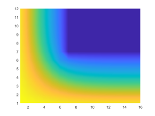
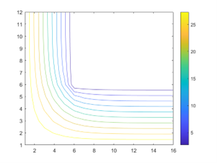

# 1. 物理问题

&emsp;&emsp;一个长方体截面的冷空气通道的尺寸如图所示。假设再垂直于纸面的方向上冷空气及通道墙壁的温度变化很小，可以忽略。试用数值方法计算下列两种情况下通道壁面中的温度分布及每米长度上通过壁面的冷量损失：（已知$\lambda_{wall}=0.53 W/(m·K)$）


（1）内、外壁分别维持在10℃及30℃；

（2）内、外壁与流体发生对流传热，且有$t_{f_1}=10 ℃, h_1=20 W/(m^2·K), t_{f_2}=30 ℃, h_2=4 W/(m^2·K)$

# 2. 模型建立

&emsp;&emsp;由对称性，选取1/4通道作为研究对象并建立笛卡尔坐标系：


# 3. 数学描述

&emsp;&emsp;针对两种情况，可得到两组对应的微分控制方程及边界条件：

## 3.1 等温——内、外壁恒温
$$
\frac{\partial^2 t}{\partial x^2}+\frac{\partial^2 t}{\partial y^2}=0
$$
$$
t|_{x=0,0\le y\le 1.1}=30
$$
$$
t|_{y=0,0\le x\le 1.5}=30
$$
$$
t|_{x=0.5,0.5\le y\le 1.1}=0
$$
$$
t|_{y=0.5,0.5\le x\le 1.5}=30
$$
$$
\frac{\partial t}{\partial x}|_{x=1.5,0\le y\le 0.5}=0
$$
$$
\frac{\partial t}{\partial y}|_{y=1.1,0\le x\le 0.5}=0
$$
## 3.2 对流——内外壁与流体发生对流传热
$$
\frac{\partial^2 t}{\partial x^2}+\frac{\partial^2 t}{\partial y^2}=0
$$
$$
-\lambda\frac{\partial t}{\partial x}|_{x=0,0\le y\le1.1}=h_2(t_{f_2}-t|_{x=0,0\le y\le 1.1})
$$
$$
-\lambda\frac{\partial t}{\partial y}|_{y=0,0\le x\le1.5}=h_2(t_{f_2}-t|_{y=0,0\le x\le 1.5})
$$
$$
-\lambda\frac{\partial t}{\partial x}|_{x=0.5,0.5\le y\le1.1}=h_1(t_{f_1}-t|_{x=0.5,0.5\le y\le 1.1})
$$
$$
-\lambda\frac{\partial t}{\partial y}|_{y=0.5,0.5\le x\le1.5}=h_1(t_{f_1}-t|_{y=0.5,0.5\le x\le 1.5})
$$
$$
\frac{\partial t}{\partial x}|_{x=1.5,0\le y\le 0.5}=0
$$
$$
\frac{\partial t}{\partial y}|_{y=1.1,0\le x\le 0.5}=0
$$
# 4. 建立离散模型方程

&emsp;&emsp;将所建模型进行离散处理，并作出如图所示网格，模型中任意一节点表示为$(i,j)$，任意节点温度表示为$t_{i,j}$（横向节点用i表示，纵向节点用j表示），两个方向上步长均为0.1m，即$\Delta x=\Delta y=0.1 m$


## 4.1 等温条件

（1）若$(i,j)$为内节点：


&emsp;&emsp;对应离散方程：
$$
\lambda\cdot\frac{t_{i,j-1}-t_{i,j}}{\Delta y}\cdot\Delta x+\lambda\cdot\frac{t_{i-1,j}-t_{i,j}}{\Delta x}\cdot\Delta y+\lambda\cdot\frac{t_{i,j+1}-t_{i,j}}{\Delta y}\cdot\Delta x+\lambda\cdot\frac{t_{i+1,j}-t_{i,j}}{\Delta x}\cdot\Delta y=0
$$
（2）若$(i,j)$为等温边界点及拐角点：

&emsp;&emsp;对应离散方程：
$$
t_{i,j}=t_{w}
$$
（3）若$(i,j)$为绝热边界点：

&emsp;&emsp;对应离散方程：
$$
\frac{t_{i,j-1}-t{i,j}}{\Delta y}=0\ \ \ \ \ 1\le i\le 4, j=11
$$
$$
\frac{t_{i-1,j}-t{i,j}}{\Delta X}=0\ \ \ \ \ \ 1\le i=j\le 4, i=15
$$

 

## 4.2 对流传热条件

（1）内节点离散方程与等温条件相同；

（2）外部对流传热边界点（不包括拐角点）：

&emsp;&emsp;对应离散方程：
$$
\lambda\cdot\frac{t_{i,j-1}-t_{i,j}}{\Delta y}\cdot\frac{\Delta x}{2} +\lambda\cdot\frac{t_{i,j+1}-t_{i,j}}{\Delta y}\cdot\frac{\Delta x}{2}+\lambda\cdot\frac{t_{i+1,j}-t_{i,j}}{\Delta x}\cdot\Delta y+h_2\cdot\Delta y\cdot(t_{f_2}-t_{i,j})=0\ \ \ \ \ i=0,1\le j\le 10
$$
$$
\lambda\cdot\frac{t_{i-1,j}-t_{i,j}}{\Delta x}\cdot\frac{\Delta y}{2} +\lambda\cdot\frac{t_{i,j+1}-t_{i,j}}{\Delta y}\cdot{\Delta x}+\lambda\cdot\frac{t_{i+1,j}-t_{i,j}}{\Delta x}\cdot\frac{\Delta y}{2}+h_2\cdot\Delta x\cdot(t_{f_2}-t_{i,j})=0\ \ \ \ \ j=0,1\le i\le 14
$$
（3）内部对流传热边界点（不包括拐角点）：

&emsp;&emsp;对应离散方程：
$$
\lambda\cdot\frac{t_{i,j-1}-t_{i,j}}{\Delta y}\cdot\frac{\Delta x}{2} +\lambda\cdot\frac{t_{i,j+1}-t_{i,j}}{\Delta y}\cdot\frac{\Delta x}{2}+\lambda\cdot\frac{t_{i-1,j}-t_{i,j}}{\Delta x}\cdot{\Delta y}+h_1\cdot\Delta y\cdot(t_{f_1}-t_{i,j})=0\ \ \ \ \ i=5,6\le j\le 10
$$
$$
\lambda\cdot\frac{t_{i,j+1}-t_{i,j}}{\Delta y}\cdot\frac{\Delta x}{2} +\lambda\cdot\frac{t_{i-1,j}-t_{i,j}}{\Delta x}\cdot\frac{\Delta y}{2}+h_2\cdot\frac{\Delta x}{2}\cdot(t_{f_2}-t_{i,j})=0\ \ \ \ \ i=15,j=0
$$
$$
\lambda\cdot\frac{t_{i,j+1}-t_{i,j}}{\Delta y}\cdot\frac{\Delta x}{2} +\lambda\cdot\frac{t_{i+1,j}-t_{i,j}}{\Delta x}\cdot\frac{\Delta y}{2}+h_2\cdot(\frac{\Delta x}{2}+\frac{\Delta y}{2})\cdot(t_{f_2}-t_{i,j})=0\ \ \ \ \ i=0,j=0
$$
$$
\lambda\cdot\frac{t_{i-1,j}-t_{i,j}}{\Delta x}\cdot{\Delta y} +\lambda\cdot\frac{t_{i,j-1}-t_{i,j}}{\Delta y}\cdot\Delta x+\lambda\cdot\frac{t_{i,j+1}-t_{i,j}}{\Delta y}\cdot\frac{\Delta x}{2} +\lambda\cdot\frac{t_{i+1,j}-t_{i,j}}{\Delta x}\cdot\frac{\Delta y}{2}+h_1\cdot(\frac{\Delta x}{2}+\frac{\Delta y}{2})\cdot(t_{f_1}-t_{i,j})=0\ \ \ \ \ i=5,j=5
$$
# 5. 已知参数
$$
\lambda=0.53W/(m·K)
$$
$$
t_{w_1}=10℃
$$
$$
t_{w_2}=30℃
$$
$$
t_{f_1}=10℃
$$
$$
h_1=20W/(m^2·K)
$$
$$
t_{f_2}=30℃
$$
$$
h_2=4W/(m^2·K)
$$
$$
\Delta x=\Delta y=0.1m
$$
# 6.求解仿真

## 6.1 等温边界

（1）温度分布

&emsp;&emsp;代码：


```matlab
clc,clear
%温度差初始化
for i=1:16
for j=1:12
t(i,j)=14;
end
end
%等温边界
for i=6:16 %BC 边
t(i,6)=0;
end
for j=6:12 %CD 边
t(6,j)=0;
end
for i=1:16 %AF 边
t(i,1)=30;
end
for j=1:12 %EF 边
t(1,j)=30;
end
n=0; %迭代次数
e=inf; %初始化相对偏差
%高斯迭代
while e>1e-6 %收敛判断
tq=t; %记录迭代前的温度
for i=1:16
for j=1:12 %内部结点
if ((i>1 && i<6 && j>5 &&j<12)||(i>1 && i<16 && j>1 &&j<6))
t(i,j)=(t(i+1,j)+t(i-1,j)+t(i,j+1)+t(i,j-1))/4;
end
if (i>1 && i<6 && j==12) %DE 边
t(i,j)=(2*t(i,j-1)+t(i-1,j)+t(i+1,j))/4;end
if (j>1 && j<6 && i==16) %AB 边
t(i,j)=(2*t(i-1,j)+t(i,j+1)+t(i,j-1))/4;
end
end
end
e=max(max(abs(t-tq)./(tq+eps))); %最大相对偏差
n=n+1;
end
disp('迭代次数:')
disp(n)
%非墙区域温度清零
for i=7:16
for j=7:12
t(i,j)=0;
end
end
disp(t') %温度分布
pcolor(t');shading interp
figure, contour(t',10);
```

&emsp;&emsp;结果：

| 30   | 24.1026 | 18.1678 | 12.1702 | 6.1065  | 0       | 0       | 0       | 0       | 0       | 0       | 0       | 0       | 0       | 0       | 0       |
| ---- | ------- | ------- | ------- | ------- | ------- | ------- | ------- | ------- | ------- | ------- | ------- | ------- | ------- | ------- | ------- |
| 30   | 24.1214 | 18.1993 | 12.2032 | 6.1279  | 0       | 0       | 0       | 0       | 0       | 0       | 0       | 0       | 0       | 0       | 0       |
| 30   | 24.1836 | 18.3046 | 12.3155 | 6.2018  | 0       | 0       | 0       | 0       | 0       | 0       | 0       | 0       | 0       | 0       | 0       |
| 30   | 24.3084 | 18.5201 | 12.5526 | 6.3637  | 0       | 0       | 0       | 0       | 0       | 0       | 0       | 0       | 0       | 0       | 0       |
| 30   | 24.5299 | 18.915  | 13.0109 | 6.7005  | 0       | 0       | 0       | 0       | 0       | 0       | 0       | 0       | 0       | 0       | 0       |
| 30   | 24.8964 | 19.5989 | 13.8756 | 7.4272  | 0       | 0       | 0       | 0       | 0       | 0       | 0       | 0       | 0       | 0       | 0       |
| 30   | 25.4568 | 20.7087 | 15.4655 | 9.1328  | 0       | 0       | 0       | 0       | 0       | 0       | 0       | 0       | 0       | 0       | 0       |
| 30   | 26.222  | 22.3137 | 18.1448 | 13.6383 | 9.1317  | 7.4249  | 6.696   | 6.3554  | 6.1864  | 6.0994  | 6.0537  | 6.0295  | 6.0169  | 6.011   | 6.0092  |
| 30   | 27.1176 | 24.1793 | 21.1618 | 18.1441 | 15.4636 | 13.8718 | 13.0036 | 12.5391 | 12.2907 | 12.1574 | 12.0858 | 12.0474 | 12.0273 | 12.0177 | 12.0148 |
| 30   | 28.069  | 26.1241 | 24.179  | 22.3128 | 20.7067 | 19.5951 | 18.9077 | 18.5067 | 18.2799 | 18.1539 | 18.0846 | 18.047  | 18.0272 | 18.0176 | 18.0148 |
| 30   | 29.0345 | 28.069  | 27.1173 | 26.2214 | 25.4555 | 24.894  | 24.5255 | 24.3001 | 24.1684 | 24.0935 | 24.0517 | 24.0289 | 24.0167 | 24.0109 | 24.0091 |
| 30   | 30      | 30      | 30      | 30      | 30      | 30      | 30      | 30      | 30      | 30      | 30      | 30      | 30      | 30      | 30      |



（2）导热量：

&emsp;&emsp;代码：
```matlab
qw=0; %外壁面导热量
qn=0; %内壁面导热量
for i=2:15
qw=qw+0.53*(t(i,1)-t(i,2)); %AF 边导热量
end
for j=2:11
qw=qw+0.53*(t(1,j)-t(2,j)); %AE 边导热量
end
qw=qw+0.53/2*(t(16,1)-t(16,2))+0.53/2*(t(1,12)-t(2,12)); %A、 E、 F 点导热量
for i=7:15
qn=qn+0.53*(t(i,5)-t(i,6)); %BC 边导热量
end
for j=7:11
qn=qn+0.53*(t(5,j)+t(6,j)); %CD 边导热量
end
qn=qn+0.53*(t(6,5)+t(5,6)-2*t(6,6))+0.53/2*(t(16,5)+t(5,12)-t(16,6)-t(6,12));
%B、 C、 D 边导热量
qw=qw*4; %外壁面总导热量
qn=qn*4; %内壁面总导热量
qz=(qw+qn)/2 %垂直于纸面方向每米长度上通过砖墙的导热量
delta=abs(qw-qn)/((qn+qw)/2) %热平衡偏差
```
&emsp;&emsp;结果：
```matlab
qz =241.7152
delta =6.1122e-06
```
即：

外壁导热量 Φ=241.7159 W， 

内壁导热量 Φ= 241.7145 W

垂直于纸面方向的每米长度上通过砖墙的导热量 Φ=241.7152W

热平衡偏差=0.00061% 。

## 6.2 对流边界

（1） 温度分布：

&emsp;&emsp;代码：
```matlab
clc,clear
%温度差初始化
for i=1:16
for j=1:12
t(i,j)=21;
end
end
n=0; %迭代次数
e=inf; %初始化相对偏差
%高斯迭代
while e>1e-6 %收敛判断
tq=t; %记录迭代前的温度
for i=1:16
for j=1:12
if ((i>1 && i<6 && j>5 &&j<12)||(i>1 && i<16 && j>1 &&j<6)) %内部结点
t(i,j)=(t(i+1,j)+t(i-1,j)+t(i,j+1)+t(i,j-1))/4;end
if (i>1 && i<6 && j==12) %DE 边
t(i,j)=(2*t(i,j-1)+t(i-1,j)+t(i+1,j))/4;
end
if (j>1 && j<6 && i==16) %AB 边
t(i,j)=(2*t(i-1,j)+t(i,j+1)+t(i,j-1))/4;
end
if (i>1 && i<16 && j==1) %AF 边
t(i,j)=(t(i-1,j)+t(i+1,j)+2*t(i,j+1)+2*10.6*0.1/0.53*30)/(4+2*10.6*0.1/0.53);
end
if (i>6 && i<16 && j==6) %BC 边
t(i,j)=(t(i-1,j)+t(i+1,j)+2*t(i,j-1)+2*3.975*0.1/0.53*10)/(4+2*3.975*0.1/0.53);
end
if (i==6 && j>6 && j<12) %CD 边
t(i,j)=(2*t(i-1,j)+t(i,j+1)+t(i,j-1)+2*3.975*0.1/0.53*10)/(4+2*3.975*0.1/0.53);
end
if (i==1 && j>1 && j<12) %EF 边
t(i,j)=(2*t(i+1,j)+t(i,j+1)+t(i,j-1)+2*10.6*0.1/0.53*30)/(4+2*10.6*0.1/0.53);
end
if (i==16 && j==1) %A 点
t(i,j)=(t(i-1,j)+t(i,j+1)+10.6*0.1/0.53*30)/(2+10.6*0.1/0.53);
end
if (i==16 && j==6) %B 点
t(i,j)=(t(i-1,j)+t(i,j-1)+3.975*0.1/0.53*10)/(2+3.975*0.1/0.53);
end
if (i==6 && j==6) %C 点
t(i,j)=(2*t(i-1,j)+2*t(i,j-1)+t(i,j+1)+t(i+1,j)+3.975*0.2/0.53*10)/(6+3.975*0.2/0.53);
end
if (i==6 && j==12) %D 点
t(i,j)=(t(i-1,j)+t(i,j-1)+3.975*0.1/0.53*10)/(2+3.975*0.1/0.53);
end
if (i==1 && j==12) %E 点
t(i,j)=(t(i+1,j)+t(i,j-1)+10.6*0.1/0.53*30)/(2+10.6*0.1/0.53);
end
if (i==1 && j==1) %F 点
t(i,j)=(t(i+1,j)+t(i,j+1)+10.6*0.2/0.53*30)/(2+10.6*0.2/0.53);
end
end
end
e=max(max(abs(t-tq)./(tq+eps))); %最大相对偏差
n=n+1;
end
disp('迭代次数:')
disp(n)
%非墙区域温度清零
for i=7:16
for j=7:12
t(i,j)=10;
end
end
disp(t') %温度分布
pcolor(t');shading interp
figure, contour(t',10);
```
&emsp;&emsp; 结果：

| 28.6132 | 25.8319 | 23.005  | 20.1097 | 17.1357 | 14.0903 | 10      | 10      | 10      | 10      | 10      | 10      | 10      | 10      | 10      | 10      |
| ------- | ------- | ------- | ------- | ------- | ------- | ------- | ------- | ------- | ------- | ------- | ------- | ------- | ------- | ------- | ------- |
| 28.621  | 25.8546 | 23.0392 | 20.149  | 17.1714 | 14.1126 | 10      | 10      | 10      | 10      | 10      | 10      | 10      | 10      | 10      | 10      |
| 28.6455 | 25.9265 | 23.148  | 20.2759 | 17.2882 | 14.1863 | 10      | 10      | 10      | 10      | 10      | 10      | 10      | 10      | 10      | 10      |
| 28.6902 | 26.0579 | 23.3504 | 20.5183 | 17.5191 | 14.3356 | 10      | 10      | 10      | 10      | 10      | 10      | 10      | 10      | 10      | 10      |
| 28.7599 | 26.2647 | 23.6773 | 20.9277 | 17.9346 | 14.621  | 10      | 10      | 10      | 10      | 10      | 10      | 10      | 10      | 10      | 10      |
| 28.8599 | 26.5635 | 24.1666 | 21.5805 | 18.6705 | 15.2108 | 10      | 10      | 10      | 10      | 10      | 10      | 10      | 10      | 10      | 10      |
| 28.9924 | 26.9629 | 24.845  | 22.5571 | 19.9561 | 16.6973 | 15.2041 | 14.608  | 14.3138 | 14.151  | 14.0558 | 13.9988 | 13.9646 | 13.9447 | 13.9344 | 13.9312 |
| 29.1534 | 27.4509 | 25.6932 | 23.8468 | 21.8996 | 19.9513 | 18.6586 | 17.9131 | 17.4835 | 17.2304 | 17.0785 | 16.9864 | 16.9309 | 16.8985 | 16.8816 | 16.8764 |
| 29.3328 | 27.9939 | 26.6301 | 25.2375 | 23.8441 | 22.5496 | 21.5658 | 20.9024 | 20.4766 | 20.2086 | 20.0413 | 19.9375 | 19.874  | 19.8367 | 19.8171 | 19.8111 |
| 29.5211 | 28.562  | 27.5956 | 26.6289 | 25.6896 | 24.8373 | 24.1527 | 23.6538 | 23.312  | 23.0862 | 22.9405 | 22.8482 | 22.791  | 22.757  | 22.7392 | 22.7336 |
| 29.7124 | 29.1371 | 28.5616 | 27.9927 | 27.448  | 26.9574 | 26.5537 | 26.2483 | 26.0312 | 25.8836 | 25.7863 | 25.7238 | 25.6846 | 25.6612 | 25.6489 | 25.6451 |
| 29.9041 | 29.7124 | 29.521  | 29.3324 | 29.1524 | 28.9905 | 28.8565 | 28.7542 | 28.6809 | 28.6307 | 28.5974 | 28.5759 | 28.5624 | 28.5544 | 28.5501 | 28.5488 |



（2）导热量：

&emsp;&emsp;代码：
```matlab
qw=0; %外壁面导热量
qn=0; %内壁面导热量
for i=2:15
qw=qw+10.6*0.1*(30-t(i,1)); %AF 边导热量
end
for j=2:11
qw=qw+10.6*0.1*(30-t(1,j)); %AE 边导热量
end
qw=qw+10.6*0.1/2*(2*30-t(16,1)-t(1,12))+10.6*0.1*(30-t(1,1)); %A、 E、 F 点导热量
for i=7:15
qn=qn+3.975*0.1*(t(i,6)-10); %BC 边导热量
end
for j=7:11
qn=qn+3.975*0.1*(t(6,j)-10); %CD 边导热量
end
qn=qn+3.975*0.1/2*(t(16,6)+t(6,12)-2*10)+3.975*0.1*(t(6,6)-10); %B、 C、 D 边导热量
qw=qw*4; %外壁面总导热量
qn=qn*4; %内壁面总导热量
qz=(qw+qn)/2 %垂直于纸面方向每米长度上通过砖墙的导热量
delta=abs(qw-qn)/((qn+qw)/2) %热平衡偏差
```

&emsp;&emsp;结果：

外壁导热量Φ=113.4404 W

内壁导热量Φ=113.4454 W

垂直于纸面方向的每米长度上通过砖墙的导热量Φ=113.4429W

热平衡偏差=0.0044%。