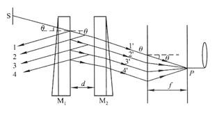
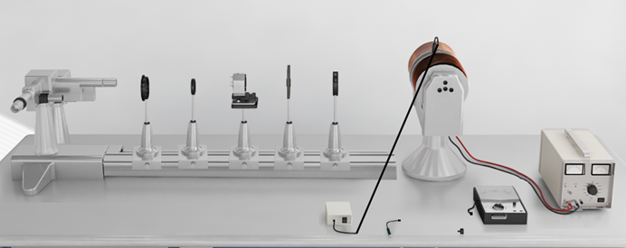
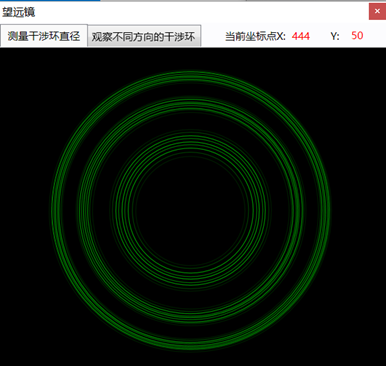

# 1. 实验目的

（1）观察塞曼效应仪，理解理论学习内容

（2）掌握测量波长差的原理

（3）测量质荷比

# 2. 实验仪器及方法

&emsp;&emsp;本实验为模拟仿真实验

# 3. 原理简述

## 3.1 观察塞曼分裂的方法

&emsp;&emsp;塞曼分裂的波长差很小，以Hg 5461 Å谱线为例，当处于B=1T的磁场中：
$$
\Delta \widetilde{v}=\frac{L}{2}=\frac{1}{2}\times46.7\times1=23.35m^{-1}
$$

$$
\Delta\lambda=\lambda^2\Delta\widetilde{v}=10^{-11}m=0.1
$$

&emsp;&emsp;要观察如此小的波长差，用一般的棱镜摄谱仪是不可能的，需要用高分辨率的仪器，如法布里—珀罗标准器（F—P标准具）。F—P标准具由平行放置的两块平面玻璃或石英板组成的，在两板相对的平面上镀薄银膜和其他有较高反射系数的薄膜。两平行的镀银平面的间隔是由某些热膨胀系数很小的材料做成的环固定起来。玻璃板上带有三个螺丝，可以精确调节两玻璃板内表面之间的平行度。标准具的光路图如下所示。从扩展光源S上发出的单色光。设到标准具板的平行平面上，经M1和M2表面的多次反射和透射，分别形成一系列相互平行的反射光束1,2,3,4.....和透射光束1’,2’,3’,4’......在透射的光束中，相邻的光程差是：
$$
\delta=2ndcos\theta
$$
&emsp;&emsp;这一系列平行光在无穷远处或透镜的焦平面上发生干涉，干涉的极大值为：
$$
2dcos\theta=K\lambda
$$
&emsp;&emsp;K为整数，称为干涉级次。

&emsp;&emsp;标准具有两个特征参量自由光谱范围和分辨本领,分别说明如下：

&emsp;&emsp;对于F—P标准具：
$$
\frac{\lambda}{\Delta\lambda}=KN
$$
&emsp;&emsp;N为精细度，两相邻干涉级间能够分辨的最大条纹数
$$
N=\frac{\pi\sqrt{R}}{1-R}
$$
&emsp;&emsp;R为反射率，R一般在90%。使用标准具时光近似正入射，sin*q* ≈0,从标准具干涉的极大值公式可得
$$
K=\frac{2d}{\lambda}
$$

## 3.2 测量塞曼分裂谱线波长差的方法

&emsp;&emsp;应用F-P标准具测量各分裂谱线的波长或者波长差是通过测量干涉环的直径来实现的。如标准具光路图所示，用透镜把F-P标准具的干涉圆环成像在焦平面上。出射角为$\theta$的圆环其直径$D$与透镜焦距$f$间的关系为：
$$
tan\theta=\frac{D}{2f}
$$
&emsp;&emsp;对于近中心处的圆环，$\theta$很小，可以认为:
$$
\theta\approx sin\theta\approx tan\theta
$$
&emsp;&emsp;而
$$
cos\theta=1-2sin^2\frac{\theta^2}{2}=1-\frac{\theta^2}{2}=1-\frac{D^2}{8f^2}
$$
&emsp;&emsp;由于
$$
2dcos\theta=K\lambda
$$
&emsp;&emsp;所以有：
$$
2dcos\theta=2d(1-\frac{D^2}{8f^2})=K\lambda
$$
&emsp;&emsp;从上式可推得同一波长$\lambda$相邻两级$K$和$K-1$级圆环直径的平方差：
$$
\Delta D^2=D_{K-1}^2-D_K^2=\frac{4f^2\lambda}{d}
$$
&emsp;&emsp;可见$\Delta D^2$是与干涉级无关的常数。设波长$\lambda_a$和$\lambda_b$的第$K$级干涉圆环直径分别为$D_a$和$D_b$，可得
$$
\lambda_a-\lambda_b=\frac{d}{4f^2K}(D_b^2-D_a^2)=(\frac{D_b^2-D_a^2}{D_{K-1}^2-D_K^2})\frac{\lambda}{K}
$$
&emsp;&emsp;将K代入，得波长差
$$
\Delta\lambda=\frac{\lambda^2}{2d}(\frac{D_b^2-D_a^2}{D_{K-1}^2-D_K^2})
$$
&emsp;&emsp;波数差
$$
\Delta\sigma=\frac{1}{2d}(\frac{D_b^2-D_a^2}{D_{K-1}^2-D_K^2})
$$

# 4. 实验相关问题列举

（1）塞曼效应相关基础知识

（2）谱线在磁场中的能级分裂

（3）塞曼分裂谱线与原谱线关系

（4）塞曼跃迁 

# 5. 原始数据及操作

## 5.1 实验操作

（1）调节光路共轴及F-P标准具平行

（2）在垂直于磁场方向观察Hg 546.1nm谱线在磁场中的分裂，用偏振片区分谱线中π和σ成分。

（3）平行于磁场方向观察Hg 546.1nm谱线在磁场中的分裂，用偏振片和1/4波晶片区分谱线中σ+和σ-成分。此时磁场方向指向观察者。

（4）垂直于磁场方向观察，用塞曼分裂计算电子荷质比e/m。

（5）验证塞曼分裂与磁感应强度的关系

## 5.2 原始数据

### 5.2.1 实验截图

### 5.2.2 实验数据

&emsp;&emsp;用1/4和偏振片区分σ+成分和σ-成分：

| 偏振片透振方向 | 0         | 45    | 90        | 135   | 180       |
| -------------- | --------- | ----- | --------- | ----- | --------- |
| 干涉图像的现象 | 内外各3根 | 外6根 | 内外各3根 | 外6根 | 内外各3根 |

&emsp;&emsp;测量电子荷质比：

| 第K级 | 第K-1级 | 第K-2级 |      |      |      |      |      |      |
| ----- | ------- | ------- | ---- | ---- | ---- | ---- | ---- | ---- |
| D3    | D2      | D1      | D3   | D2   | D1   | D3   | D2   | D1   |
| 188   | 202     | 216     | 292  | 302  | 312  | 366  | 376  | 384  |

&emsp;&emsp;测量得到磁场大小为：B=350mT

&emsp;&emsp;标准具常数d=5mm

# 6. 测量内容与数据处理

&emsp;&emsp;计算得荷质比$\frac{e}{m}=1.884\times10^{11}C/kg$

&emsp;&emsp;理论值：$1.758\times10^{11}$

&emsp;&emsp;相对误差：$7.06\%$

# 7. 误差分析

（1）调节定轴等高时存在误差

（2）计算直径时存在误差

（3）计算时的人为误差

 