```fortran
program main
implicit none
real::A=1.0,B=3.5,T=10.0,X=5.0
integer::I=-5,J=7,K=3
print*,'-(A+T)=',-(A+T)
print*,'(B+(X/T))/(4.0*A)',(B+(X/T))/(4.0*A)
print*,'(I*J)/K=',(I*J)/K
print*,'(I/K)*J+T/X=',(I/K)*J+T/X
print*,'-(K+1)/5+I*A-B=',-(K+1)/5+I*A-B
print*,'SQRT(REAL(ABS(K)+1))=',SQRT(REAL(ABS(K)+1))
print*,'MAX(J,MOD(J,K))=',MAX(J,MOD(J,K))
print*,'J+INT(T/B)/2=',J+INT(T/B)/2
end program main
```

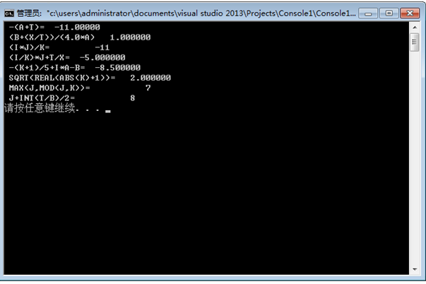

```fortran
program main
implicit none
real::a=1.0,b=2.0,c=-1.0
print*,(3*a*a+4*b*b)/(a-b)
print*,(-b+SQRT(b*b-4*a*c))/2*a
print*,(6*log(b+c)*(b+c))/(140/(3+a))
print*,cos(b/sqrt(a*a+b*b))
print*,sin(1/(tan(sqrt(a*a+b*b)/abs(c))))
end program main
```

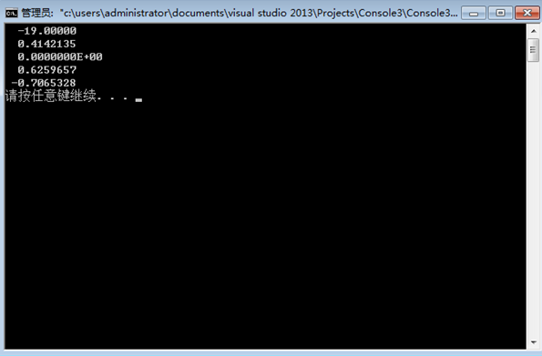

```fortran
program main
    implicit none
    real ::l1=10,l2=20,l3=18,l4=15,l5=21,l6=14,l7=30,l8=36,l9=28
    real s
    s=area(l5,l6,l9)+area(l1,l8,l9)+area(l2,l7,l8)+area(l3,l4,l7)
    print*,'六边形的面积等于',s
    contains
    function area(a,b,c)
        real a,b,c,s,area
        s=(a+b+c)/2
        area=sqrt(s*(s-a)*(s-b)*(s-c))
    end function area
end program
```

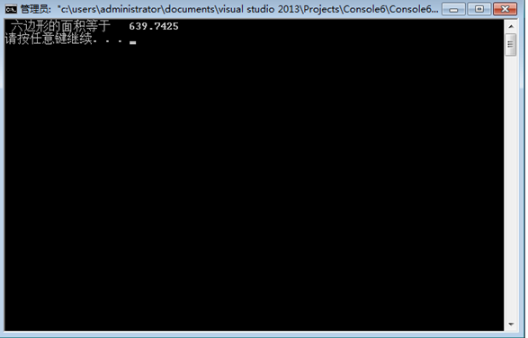

```fortran
program main
implicit none
integer c,n
real a
read*,n
do c=1,n
a=13*1.015
end do
print*,a
end program main
```

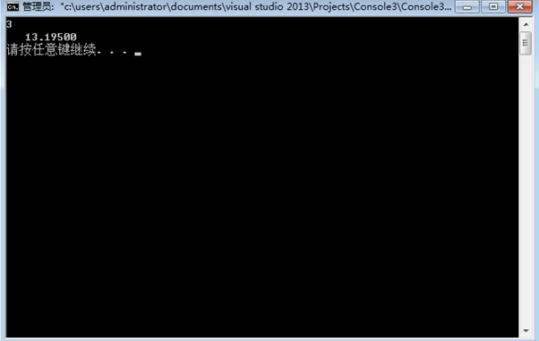

```fortran
program main
    implicit none
    real ::l1=10,l2=20,l3=18,l4=15,l5=21,l6=14,l7=30,l8=36,l9=28
    real s
    s=area(l5,l6,l9)+area(l1,l8,l9)+area(l2,l7,l8)+area(l3,l4,l7)
    print*,'六边形的面积等于',s
    contains
    function area(a,b,c)
        real a,b,c,s,area
        s=(a+b+c)/2
        area=sqrt(s*(s-a)*(s-b)*(s-c))
    end function area
end program
```


```fortran
program Newton
    implicit none
    real f,df
    integer ::N=0
    integer ::MaxN=100
    real ::eps=1.0e-6
    real ::x=-5
    Do while(abs(f(x))>eps.and.n<MaxN)
        x=x-f(x)/df(x)
        n=n+1
    end do
    if(f(x)<eps)then
        print*,'Newton converged'
        print*,'迭代次数N=',n
        print*,'x=',x,'f(x)=',f(x)
    else
        print*,'Newton deverged'
    end if
end program Newton
function f(x)
    real f,x
    f=x*x+4*x+1
end function f
function df(x)
    real df,x
    df=2*x+4
end function df
```

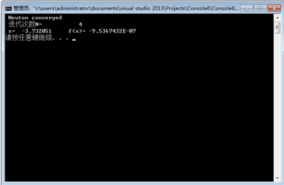

```fortran
program Newton
    implicit none
    real f,df
    integer ::N=0
    integer ::MaxN=100
    real ::eps=1.0e-6
    real ::x=-5
    Do while(abs(f(x))>eps.and.n<MaxN)
        x=x-f(x)/df(x)
        n=n+1
    end do
    if(f(x)<eps)then
        print*,'Newton converged'
        print*,'迭代次数N=',n
        print*,'x=',x,'f(x)=',f(x)
    else
        print*,'Newton deverged'
    end if
end program Newton
function f(x)
    real f,x
    f=7*x*x*x*x+6*x*x*x-5*x*x+4*x+3
end function f
function df(x)
    real df,x
    df=28*x*x*x+18*x*x-10*x+4
end function df
```

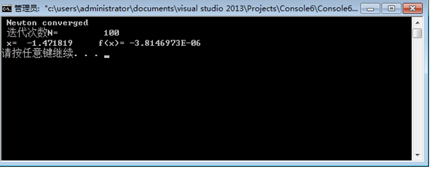

```fortran
program main
    implicit none
    real a,b,c,d,e,f,g,h,i,j,y,t,u,o,p,q,w,z,m
    t=1;u=2;o=3;p=4;q=5;w=6;z=7;m=8
    call su(a,b,t,u)
    call su(c,d,o,p)
    call su(e,f,q,w)
    call su(g,h,z,m)
    call su(i,j,u,o)
    y=a+c+c+e+g+d*f-j
    print*,y
    contains
    subroutine su(s,t,n1,n2)
    real s,t,n1,n2
    s=n1+n2
    t=n1*n2
    end subroutine su
end program
```

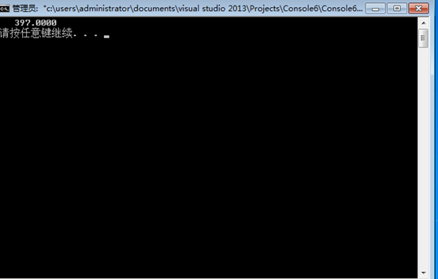

```fortran
Module aoligei
    implicit none
    real,parameter ::pi=3.1415926,e=2.71828
    contains
        function su(n)
            integer su,n
            integer i
            su=0
            do i=1,n
                su=su+i*i
            end do
        end function su
        
        function tt(n)
            integer tt,n
            integer j
            tt=1
            do j=1,n
                tt=tt*j
            end do
        end function tt
end module aoligei
program main
    use aoligei 
    implicit none
    integer n,i
    real a,r,r0,s
    s=1
    print*,'please input n a r r0:'
    read*,n,a,r,r0
    print*,'第一个=',real(tt(n))/su(n)
    do i=1,n
        s=s*(r/r0)
    end do
    print*,'第二个=',((a*n)/2*pi*r*r)*s*exp(-s)
end program
```

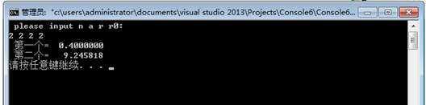

```fortran
MODULE mod
    implicit none
    interface ACR
        module procedure ACRreal,ACRinteger
    end interface
    contains
        FUNCTION ACRreal(X,Y)
            REAL,INTENT(IN)::X,Y
            INTEGER ACRreal
            INTEGER A
            IF(X>Y)THEN
                A=X/Y
                ACRreal=X-Y*A
            ELSE
                A=Y/X
                ACRreal=Y-X*A
            ENDIF
        END FUNCTION
        FUNCTION ACRinteger(X,Y)
            INTEGER,INTENT(IN)::X,Y
            INTEGER ACRinteger
            INTEGER B
            IF(X>Y)THEN
                B=X/Y
                ACRinteger=X-Y*B
            ELSE
                B=Y/X
                ACRinteger=Y-X*B
            ENDIF
        END FUNCTION
    END MODULE
    PROGRAM main
        USE mod    
        implicit none
        REAL A,B
        INTEGER C,D
        READ(*,*)A,B
        READ(*,*)C,D
        PRINT*,ACR(A,B)
        PRINT*,ACR(C,D)
END PROGRAM
```

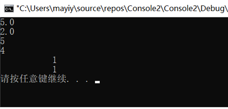

```fortran
PROGRAM MAIN
    IMPLICIT NONE
    INTEGER A,B,C,D,E
    READ*,A,B,C
    IF(A<B)THEN
        IF(B<C)THEN
            D=GDC(A,B)     !A<B<C
            E=GDC(D,C)
        ELSE IF(A<C)THEN
            D=GDC(A,C)     !A<C<B
            E=GDC(D,B)
        ELSE
            D=GDC(C,A)     !C<A<B
            E=GDC(D,B)
        END IF
    ELSE
        IF(A<C)THEN
            D=GDC(A,B)     !B<A<C
            E=GDC(D,C)
        ELSE IF(B<C)THEN
            D=GDC(B,C)     !B<C<A
            E=GDC(D,A) 
        ELSE
            D=GDC(B,C)     !C<B<A
            E=GDC(D,A)
        END IF
    END IF
    PRINT*,E
    CONTAINS
    FUNCTION GDC(X,Y)
        INTEGER GDC,X,Y,Z,Q
        IF(X<Y)THEN
            Q=X
            X=Y
            Y=Q
        END IF
        DO WHILE(Y>0) 
            Z=Y
            Y=MOD(X,Y)
            X=Z
        END DO
        GDC=X
    END FUNCTION
END PROGRAM
```

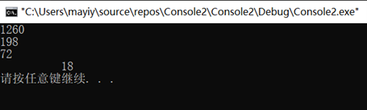

```fortran
PROGRAM MAIN
    IMPLICIT NONE
    REAL X
    READ*,X
    PRINT*,SINHH(X)
    CONTAINS
        RECURSIVE FUNCTION FUN(X,N) RESULT(F)
            REAL F,N,X
            IF(N==0)THEN
                F=1
            ELSE
                F=FUN(X,N-1)*(X/N)
            END IF
        END FUNCTION
        FUNCTION E(X)
            REAL::N=0
            REAL::Y=0
            REAL X,E,G
            G=FUN(X,N)
            DO WHILE(ABS(G)>=0.000001)
                Y=Y+FUN(X,N)
                N=N+1
                G=FUN(X,N)
            END DO
            E=Y
        END FUNCTION
        FUNCTION SINHH(X)
            REAL X,SINHH
            SINHH=(E(X)-1/E(X))/2
        END FUNCTION
END PROGRAM
```

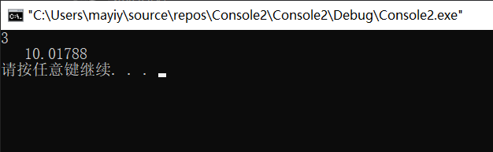

```fortran
PROGRAM MAIN
    IMPLICIT NONE
    REAL X,Y
    INTEGER I
    Y=1.0
    X=0
    DO I=1,10
        Y=Y+0.1*(Y*Y-X*X)
        X=X+0.1
        PRINT*,'X=',X,'Y=',Y
    END DO
END
```

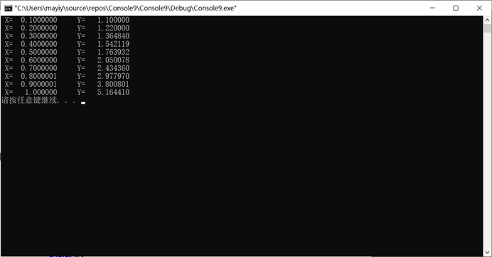

```fortran
PROGRAM MAIN
    IMPLICIT NONE
    INTEGER X,Y
    READ*,X
    IF(X<0.OR.X>=30)THEN
        PRINT*,'ERROR!'
    ELSE IF(X>=0.AND.X<10)THEN
        Y=X
    ELSE IF(X>=10.AND.X<20)THEN
        Y=X*X+1
    ELSE
        Y=X*X*X+X*X+1
    END IF
    PRINT*,Y
END PROGRAM
```

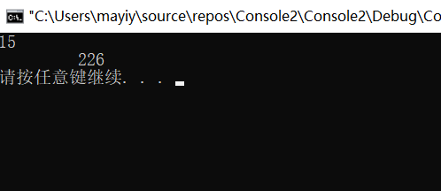

```fortran
PROGRAM MAIN
    IMPLICIT NONE
    REAL A(4)
    REAL TEMP,I
    DO I=1,4
        READ*,A(I)
    END DO
    DO I=1,3
        IF(A(I)<A(I+1))THEN 
            TEMP=A(I)
            A(I)=A(I+1)
            A(I+1)=TEMP
        END IF
    END DO
    DO I=1,2
        IF(A(I)<A(I+1))THEN
            TEMP=A(I)
            A(I)=A(I+1)
            A(I+1)=TEMP
        END IF
    END DO
    IF(A(1)<A(2))THEN
            TEMP=A(1)
            A(1)=A(2)
            A(2)=TEMP
    END IF
    PRINT*,A
END PROGRAM
```

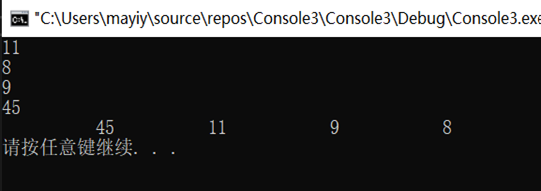

```fortran
PROGRAM MAIN
    IMPLICIT NONE
    INTEGER X,S
    READ*,X
    CALL SUB(X,S)
    IF(S==0)THEN
        PRINT*,'不是素数'
    END IF
    IF(S==1)THEN
        PRINT*,'是素数'
    END IF
    CONTAINS
    SUBROUTINE SUB(X,S)
        INTEGER I,S,X
        S=1
        IF(X==1)S=0
        IF(X==2)S=1
        DO I=2,X-1
            IF(MOD(X,I)==0)THEN
                S=0
                EXIT
            END IF
        END DO
    END SUBROUTINE
END PROGRAM
```

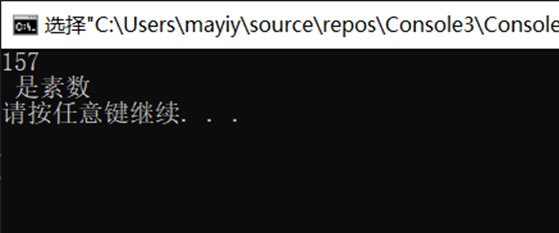

```fortran
PROGRAM MAIN
    IMPLICIT NONE
    INTEGER N,I,J,X,Y
    DO I=6,1000,2
        N=0
        DO J=1,I/2,2
            CALL SUB(J,X)
            CALL SUB(I-J,Y)
            IF(X==1.AND.Y==1)THEN
                PRINT*,I,'=',J,'+',(I-J)
                N=N+1
            END IF
        END DO
        IF(N==0)THEN
            PRINT*,'哥德巴赫猜想不成立'
            EXIT
        END IF
        PRINT*,'N=',N
    END DO
    
    CONTAINS
        SUBROUTINE SUB(X,S)
            INTEGER I,S,X
            S=1
            IF(X==1)S=0
            IF(X==2)S=1
            DO I=2,X-1
                IF(MOD(X,I)==0)THEN
                    S=0
                    EXIT
                END IF 
            END DO
        END SUBROUTINE
END PROGRAM
```

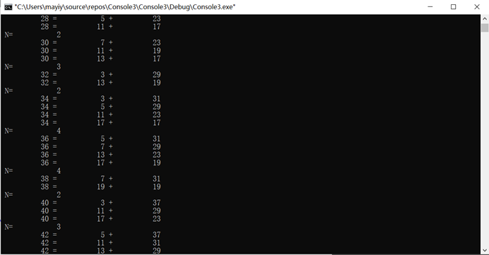

```fortran
PROGRAM MAIN
    IMPLICIT NONE
    INTEGER X
    INTEGER::I=2
    READ*,X
    PRINT*,'          1'
    DO WHILE(X/=0)
        IF(MOD(X,I)==0)THEN
            X=X/I
            PRINT*,I
            CYCLE
        END IF
        I=I+1
    END DO 
END PROGRAM
```

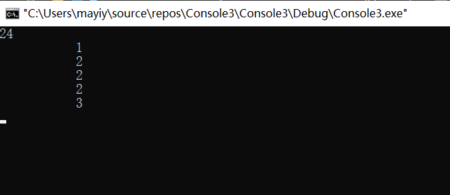

```fortran
program main
implicit none
integer i,j,n
integer,allocatable ::  a(:,:)
write(*,*)"请输入要打印的行数："
read(*,*)n
allocate(a(n,n))
write(*,*) "杨辉三角的展开式为："
do i=1,n
  do j=1,i
     if(j==1.or.j==i)then
       a(i,j)=1
     else
       a(i,j)=a(i-1,j-1)+a(i-1,j)
     end if
    end do
  write(*,'(100i5)')(a(i,j),j=1,i)
    end do
end
```

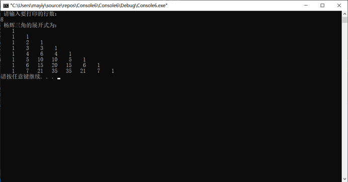

```fortran
program main
    integer a(4,4),b(4,4),c(4,4),i,j
    print*,"输入矩阵a："
    do i=1,4
        do j=1,4
            read*,a(i,j)
        enddo
    enddo
    print*,"输入矩阵b："
    do i=1,4
        do j=1,4
            read*,b(i,j)
        enddo
    enddo
    call plus(a,b,c)
    print*,"c矩阵为："
WRITE(*,'(I3,I3,I3,I3,/,I3,I3,I3,I3,/,I3,I3,I3,I3,/,I3,I3,I3,I3)')((c(I,J),I=1,4),J=1,4)
    contains
        subroutine plus(a,b,c)
            integer a(4,4),b(4,4),c(4,4),i,j,k
            do i=1,4
                do j=1,4
                    c(i,j)=0
                    do k=1,4
                        c(i,j)=c(i,j)+a(i,k)*b(k,j)
                    enddo
                enddo
            enddo
        end subroutine
end
```

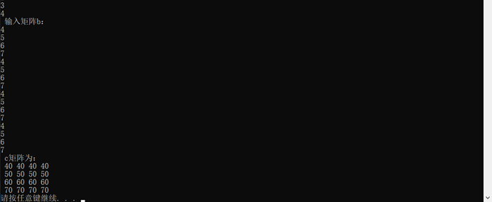

```fortran
PROGRAM MAIN
    implicit none
    integer::i,j,N,X,TMP
    INTEGER,ALLOCATABLE::A(:)
    PRINT*,"请输入要排序的个数："
    READ*,X
    ALLOCATE(A(X))
    PRINT*,"请输入要排序的数："
    DO I=1,X
        READ*,A(I)
    END DO
    do i=1,X-1
        do j=i+1,X
            if(A(j)<A(i))then
                tmp=A(i)
                A(i)=A(j)
                A(j)=tmp
            end if
        end do
    end do
    PRINT*,"排序结果为："
    do i=1,X
        print *, A(i)
    end do
END
```

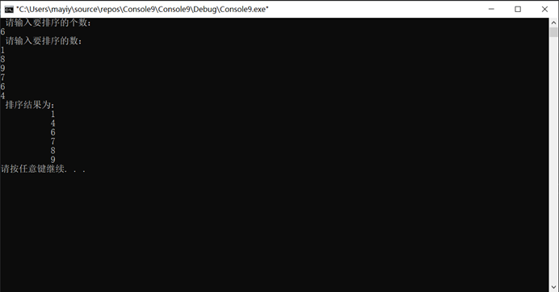

```fortran
PROGRAM MAIN
   IMPLICIT NONE
   INTEGER,ALLOCATABLE::A(:),B(:),C(:),D(:)
   INTEGER I,J,X,Y
   PRINT*,"SIZE A:"
   READ*,I
   PRINT*,"SIZE B:"
   READ*,J
   ALLOCATE(A(I),B(J),C(I),D(J))
   C=1
   D=1
   PRINT*,"READ A:"
   DO X=1,I
       READ*,A(X)
   END DO
   PRINT*,"READ B:"
   DO Y=1,J
       READ*,B(Y)
   END DO
   DO X=1,I
       DO Y=1,J
           IF(A(X)==B(Y))THEN
           C(X)=0
           D(Y)=0
           END IF
       END DO
   END DO
   PRINT*,"A:"
   DO X=1,I
       IF(C(X)/=0)THEN
           PRINT*,A(X)
       END IF
   END DO
   PRINT*,"B:"
   DO Y=1,J
       IF(D(Y)/=0)THEN
           PRINT*,B(Y)
       END IF
   END DO
END
```

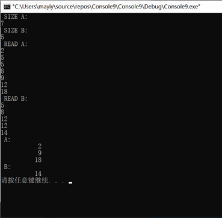

```fortran
PROGRAM MAIN
    IMPLICIT NONE
    INTEGER A(10),B(10),I
    DO I=1,10
        READ*,A(I)
    END DO
    DO I=1,10
        B(11-I)=A(I)
    END DO
    WRITE(*,"(I3,I3,I3,I3,I3,I3,I3,I3,I3,I3)")(B(I),I=1,10)
END
```

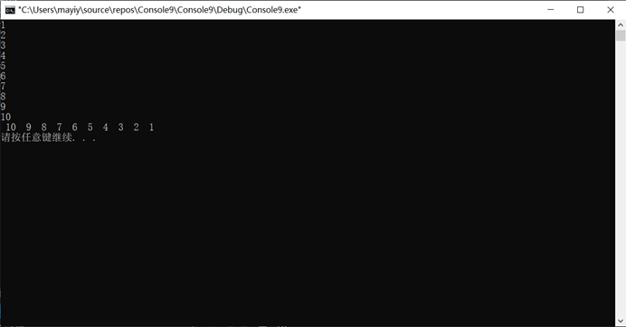

```fortran
PROGRAM MAIN
    IMPLICIT NONE
    INTEGER A(5),I,N
    DATA A/1,2,8,2,10/
    DO N=1,5
        PRINT*,(A(I),I=7-N,5),(A(I),I=1,6-N)
    END DO
END
```


```fortran
PROGRAM MAIN
	IMPLICIT NONE      
	INTEGER,ALLOCATABLE::A(:)
	INTEGER N,I,MIN,J,TMP
	PRINT*,"SIZE:"
	READ*,N
	ALLOCATE(A(N))
	PRINT*,"输入数据："
	DO I=1,N
    		READ*,A(I)
	END DO
	DO I=1,N-1
    		MIN=I
    		DO J=I+1,N
        		IF (A(J) < A(MIN)) THEN
            		MIN=J
        		END IF
    		END DO
    		TMP=A(MIN)
    		A(MIN)=A(I)
    		A(I)=TMP
    		PRINT*,A
	END DO
END
```

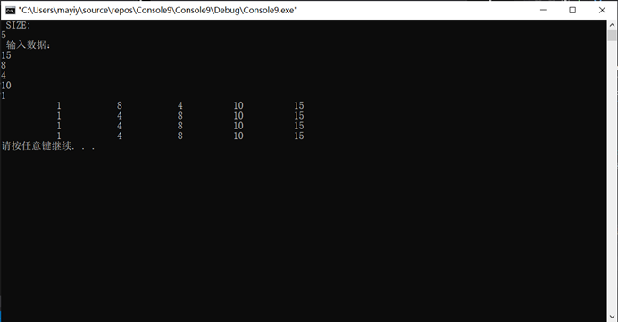

```fortran
PROGRAM MAIN
    IMPLICIT NONE
    INTEGER::A(3,4)=(/1,5,7,2,1,8,3,-3,11,1,-4,-3/)
    INTEGER I,M,N,J,L
    REAL X1,X2,X3
    IF(A(1,1)/=0)THEN
        DO I=2,3
            L=A(I,1)/A(1,1)
            DO N=1,4
                A(I,N)=A(I,N)-L*A(1,N)
            END DO
        END DO
    END IF
    IF(A(2,2)/=0)THEN
        M=A(3,2)/A(2,2)
        DO J=2,4
            A(3,J)=A(3,J)-M*A(2,J)
        END DO
    END IF
    X3=A(3,4)/A(3,3)
    X2=(A(2,4)-X3*A(2,3))/A(2,2)
    X1=(A(1,4)-X3*A(1,3)-X2*A(1,2))/A(1,1)
    PRINT*,X1,X2,X3
END
```

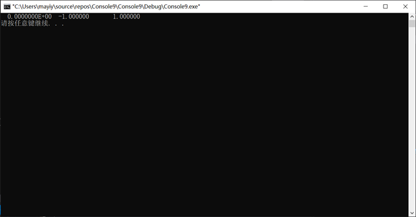

```fortran
PROGRAM MAIN
    TYPE STUDENT
        INTEGER NUMBER
        CHARACTER(10) NAME
        REAL A,B,C,AVR
    END TYPE
    INTEGER I,J,K,M,N
    TYPE(STUDENT)::E,F
    TYPE(STUDENT)::S(10)
    DO I=1,10
        WRITE(*,"('请输入第',I2,'个人的姓名：')"),I
        READ*,S(I).NAME
        WRITE(*,"('请输入第',I2,'个人的学号：')"),I
        READ*,S(I).NUMBER
        WRITE(*,"('请输入第',I2,'个人的第一门课成绩:')"),I
        READ*,S(I).A
        WRITE(*,"('请输入第',I2,'个人的第二门课成绩:')"),I
        READ*,S(I).B
        WRITE(*,"('请输入第',I2,'个人的第三门课成绩:')"),I
        READ*,S(I).C
        S(I).AVR=(S(I).A+S(I).B+S(I).C)/3
    END DO
    DO J=1,9
        DO K=J+1,10
            IF(S(J).NUMBER>S(K).NUMBER)THEN
                E=S(J)
                S(J)=S(K)
                S(K)=E
            END IF
        END DO
    END DO
    WRITE(*,'("按学号排序：")')
    DO I=1,10
        PRINT*,S(I).NAME,S(I).NUMBER,S(I).A,S(I).B,S(I).C,S(I).AVR
    END DO
    WRITE(*,'(2/)')
    WRITE(*,'("按均分排序：")')
    DO J=1,9
        DO K=J+1,10
            IF(S(J).AVR>S(K).AVR)THEN
                E=S(J)
                S(J)=S(K)
                S(K)=E
            END IF
        END DO
    END DO
    DO I=1,10
        PRINT*,S(I).NAME,S(I).NUMBER,S(I).A,S(I).B,S(I).C,S(I).AVR
    END DO 
END
```

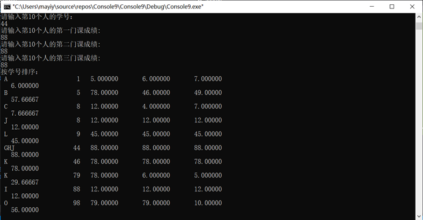

```fortran
MODULE UNION_OF_SETS
    IMPLICIT NONE
    INTEGER,PARAMETER::MAX=50
    TYPE::SET
        INTEGER NUMBER
        INTEGER,DIMENSION(MAX)::ELEMENTS
    END TYPE
    INTERFACE OPERATOR(.IN.)
        MODULE PROCEDURE ELEMENTOF
    END INTERFACE
    INTERFACE OPERATOR(+)
        MODULE PROCEDURE UNION_OF_SET
    END INTERFACE

    CONTAINS
    
    FUNCTION UNION_OF_SET(S1,S2)
    TYPE(SET),INTENT(IN)::S1,S2
    TYPE(SET)UNION_OF_SET
    INTEGER I,J
    UNION_OF_SET%NUMBER=0
    DO I=1,S1%NUMBER
        UNION_OF_SET%NUMBER=UNION_OF_SET%NUMBER+1
        UNION_OF_SET%ELEMENTS(UNION_OF_SET%NUMBER)=S1.ELEMENTS(I)
    END DO
    DO J=1,S2%NUMBER
        IF(.NOT.(S2.ELEMENTS(J).IN.UNION_OF_SET))THEN
            UNION_OF_SET%NUMBER=UNION_OF_SET%NUMBER+1
            UNION_OF_SET%ELEMENTS(UNION_OF_SET%NUMBER)=S2.ELEMENTS(J)
        END IF
    END DO
    END FUNCTION UNION_OF_SET
    
    FUNCTION ELEMENTOF(X,S)
    INTEGER,INTENT(IN)::X
    TYPE(SET),INTENT(IN)::S
    LOGICAL ELEMENTOF
    ELEMENTOF=ANY(S.ELEMENTS(1:S.NUMBER)==X)
    END FUNCTION ELEMENTOF
    
    SUBROUTINE PRINTSET(S)
    TYPE(SET)S
    INTEGER I
    PRINT'(20I4)',(S.ELEMENTS(I),I=1,S.NUMBER)
    END SUBROUTINE PRINTSET
    
    END MODULE
    
    PROGRAM MAIN
    USE UNION_OF_SETS
    IMPLICIT NONE
    TYPE(SET)::S1,S2,S3
    INTEGER I,J
    PRINT*,"PLEASE INPUT THE NUMBER OF S1:"
    READ*,S1.NUMBER
    DO I=1,S1.NUMBER
        PRINT 10,"PLEASE INPUT THE",I,"ELEMENT OF S1:"
        READ*,S1.ELEMENTS(I)
10      FORMAT(A,I2,A)   
    END DO
    PRINT*,"PLEASE INPUT THE NUMBER OF S2:"
    READ*,S2.NUMBER
    DO I=1,S2.NUMBER
        PRINT 10,"PLEASE INPUT THE",I,"ELEMENT OF S2:"
        READ*,S2.ELEMENTS(I)
    END DO
    S3=S1+S2
    WRITE(*,"('S1+S2',I3,'ELEMENTS:')",ADVANCE='NO')S3.NUMBER
    CALL PRINTSET(S3)
    END PROGRAM
```

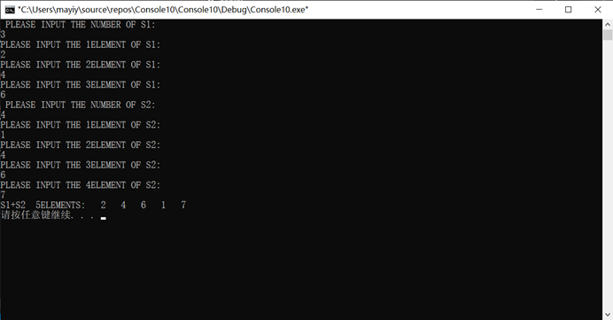

```fortran
MODULE UNION_OF_SETS
    IMPLICIT NONE
    INTEGER,PARAMETER::MAX=50
    TYPE::SET
        INTEGER NUMBER
        INTEGER,DIMENSION(MAX)::ELEMENTS
    END TYPE
    INTERFACE OPERATOR(.IN.)
        MODULE PROCEDURE ELEMENTOF
    END INTERFACE
    INTERFACE OPERATOR(-)
        MODULE PROCEDURE CHAJI
    END INTERFACE

    CONTAINS
    
    FUNCTION CHAJI(S1,S2)
    TYPE(SET),INTENT(IN)::S1,S2
    TYPE(SET)CHAJI
    INTEGER I,J
    CHAJI%NUMBER=0
    DO I=1,S1%NUMBER
        IF(.NOT.(S1.ELEMENTS(I).IN.S2))THEN
            CHAJI%NUMBER=CHAJI%NUMBER+1
            CHAJI%ELEMENTS(CHAJI%NUMBER)=S1.ELEMENTS(I)
        END IF
    END DO
    END FUNCTION CHAJI
    
    FUNCTION ELEMENTOF(X,S)
    INTEGER,INTENT(IN)::X
    TYPE(SET),INTENT(IN)::S
    LOGICAL ELEMENTOF
    ELEMENTOF=ANY(S.ELEMENTS(1:S.NUMBER)==X)
    END FUNCTION ELEMENTOF
    
    SUBROUTINE PRINTSET(S)
    TYPE(SET)S
    INTEGER I
    PRINT'(20I4)',(S.ELEMENTS(I),I=1,S.NUMBER)
    END SUBROUTINE PRINTSET
    
    END MODULE
    
    PROGRAM MAIN
    USE UNION_OF_SETS
    IMPLICIT NONE
    TYPE(SET)::S1,S2,S3
    INTEGER I,J
    PRINT*,"PLEASE INPUT THE NUMBER OF S1:"
    READ*,S1.NUMBER
    DO I=1,S1.NUMBER
        PRINT 10,"PLEASE INPUT THE",I,"ELEMENT OF S1:"
        READ*,S1.ELEMENTS(I)
10      FORMAT(A,I2,A)   
    END DO
    PRINT*,"PLEASE INPUT THE NUMBER OF S2:"
    READ*,S2.NUMBER
    DO I=1,S2.NUMBER
        PRINT 10,"PLEASE INPUT THE",I,"ELEMENT OF S2:"
        READ*,S2.ELEMENTS(I)
    END DO
    S3=S1-S2
    WRITE(*,"('S1-S2',I3,'ELEMENTS:')",ADVANCE='NO')S3.NUMBER
    CALL PRINTSET(S3)
END PROGRAM
```


```fortran
PROGRAM MAIN
    IMPLICIT NONE
    REAL I,J,K
    READ(*,'(I2)')I
    PRINT'(I2)',I
    READ(*,'(I4)')I
    PRINT'(I4)',I
    READ(*,'(I4.2)')I
    PRINT'(I4.2)',I
END
```

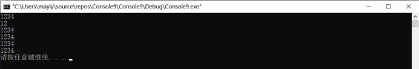

```fortran
PROGRAM MAIN
    IMPLICIT NONE
    REAL I,J,K,M,N,H,A
    PRINT*,("自由格式:")
    READ(*,*)I
    PRINT*,I
    PRINT*,("F6.2")
    READ(*,'(F6.2)')J
    PRINT '(F6.2)',J
    PRINT*,("E8.2")
    READ(*,'(E8.2)')K
    PRINT '(E8.2)',K
    PRINT*,("E12.2E3")
    READ(*,'(E12.2E3)')M
    PRINT '(E12.2E3)',M
    PRINT*,("G6.2")
    READ(*,'(G6.2)')N
    PRINT '(G6.2)',N
    PRINT*,("EN10.2")
    READ(*,'(EN10.2)')H
    PRINT '(EN10.2)',H
    PRINT*,("ES10.2")
    READ(*,'(ES10.2)')A
    PRINT '(ES10.2)',A
END
```

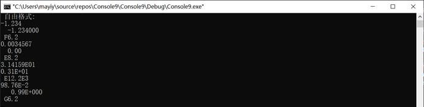

```fortran
PROGRAM MAIN
    IMPLICIT NONE
    COMPLEX::I=(1.23,-8.9E-02)
    PRINT*,("自由格式：")
    PRINT*,I
    PRINT*,("F6.2")
    PRINT'(F6.2)',I
    PRINT*,("E8.2")
    PRINT'(E8.2)',I
END
```

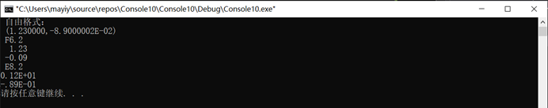

```fortran
PROGRAM MAIN
    IMPLICIT NONE
    LOGICAL I,J,K
    PRINT*,("自由格式：")
    READ(*,*)I
    PRINT*,I
    PRINT*,("L")
    READ(*,'(L)'),J
    PRINT'(L)',J
    PRINT*,("L4")
    READ(*,'(L4)'),K
    PRINT'(L4)',K
END
```


```fortran
PROGRAM MAIN
    IMPLICIT NONE
   CHARACTER I,J,K,M
   PRINT*,("自由格式：")
   READ(*,*)I
   PRINT*,I
   PRINT*,("A")
   READ(*,'(A)'),J
   PRINT'(A)',J
   PRINT*,("A3")
   READ(*,'(A3)'),K
   PRINT*,("A5")
   READ(*,'(A5)'),M
   PRINT'(A5)',M
END
```

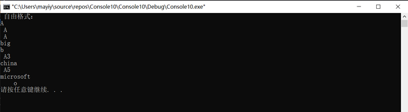

```fortran
PROGRAM MAIN
    IMPLICIT NONE
    INTEGER N
    CHARACTER(5),ALLOCATABLE::A(:,:)
    INTEGER I,J
    READ*,N
    ALLOCATE(A(N,2*N-1))
    DO I=1,N
        DO J=1,2*N-1
            IF(J>N-I.AND.J<N+I)THEN
                A(I,J)='*'
            END IF
        END DO
    END DO
    DO I=1,N
        PRINT*,A(I,:)
    END DO
END
```

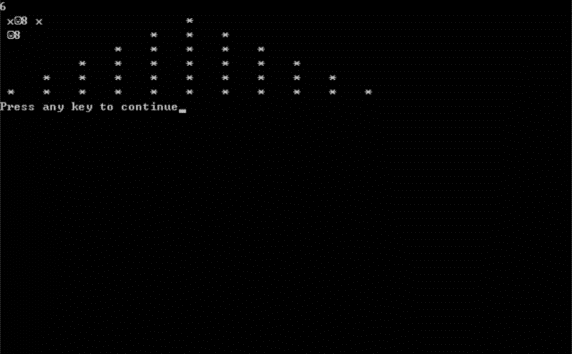

```fortran
PROGRAM MAIN
    IMPLICIT NONE
    INTEGER::I,N
    INTEGER,ALLOCATABLE::X(:,:)
    CHARACTER(14)::F
    PRINT*,'PLEASE INPUT THE ROWS:'
    READ*,N
    ALLOCATE(X(N,N))
    X=0
    X(1,1)=1
    DO I=2,N
        X(:,I)=(/0,X(1:N-1,I-1)/)+X(:,I-1)
    END DO
    DO I=1,N
        F="(10X,99I6)"
        WRITE(F(2:3),'(I2)'),(N-I)*3+1
        PRINT F,X(1:I,I)
    END DO
    DEALLOCATE(X)
    END
```

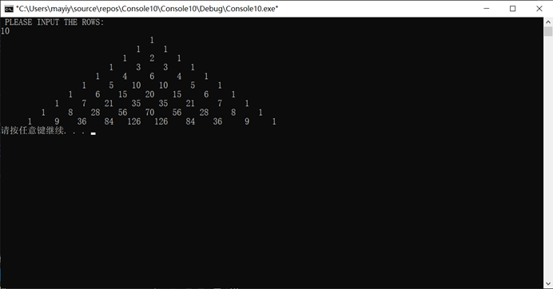

```fortran
PROGRAM MAIN
    IMPLICIT NONE
    REAL,PARAMETER::DX=0.1
    REAL::X0=0.0,Y0=1.0,X1
    X1=X0+DX
    PRINT*,'TO SOLVE IT'
    PRINT*,'WHEN X=',X0,'Y=',Y0
    PRINT*,'THE FOMATTED FILE DATA1.TXT AND THE UNDORMATTED FILE DATA2.TXT.'
    OPEN(11,FILE='DATA1.TXT')
    OPEN(12,FILE='DATA2,TXT',FORM='UNFORMATTED')
    DO WHILE(X0<100)
        Y0=RUNGE(F,X0,Y0,X1)
        PRINT*,'WHEN X=',X1,'Y=',Y0
        WRITE(11,*)X1,Y0
        WRITE(12)X1,Y0
        X0=X1
        X1=X1+DX
    END DO
    CLOSE(11)
    CLOSE(12)
    CONTAINS
    FUNCTION RUNGE(F,X0,Y0,X1)
    IMPLICIT NONE
    REAL::F,X0,Y0,X1,RUNGE,H,K1,K2,K3,K4
    H=X1-X0
    K1=H*F(X0,Y0)
    K2=H*F(X0+H/2.0,Y0+K1/2.0)
    K3=H*F(X0+H/2.0,Y0+K2/2.0)
    K4=H*F(X0+H,Y0+K3)
    RUNGE=Y0+(K1+2.0*K2+2.0*K3+K4)/6.0
    END FUNCTION
    FUNCTION F(X,Y)
    IMPLICIT NONE
    REAL::X,Y,F
    F=y**2-X**2
    END FUNCTION
    END PROGRAM
```

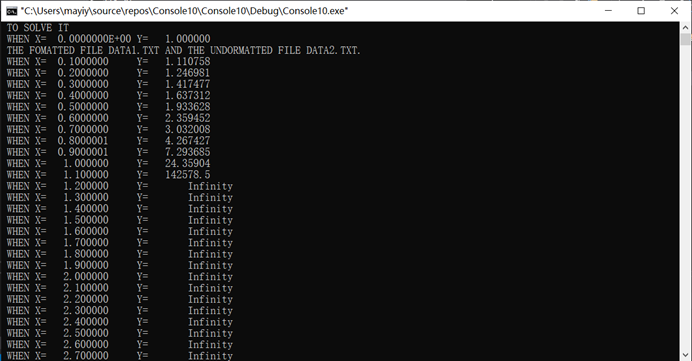