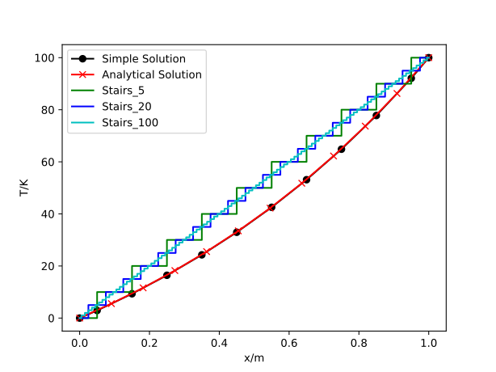
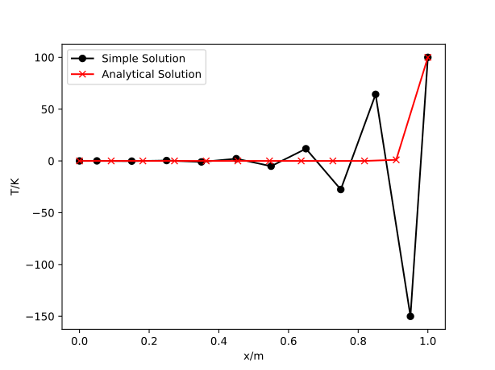
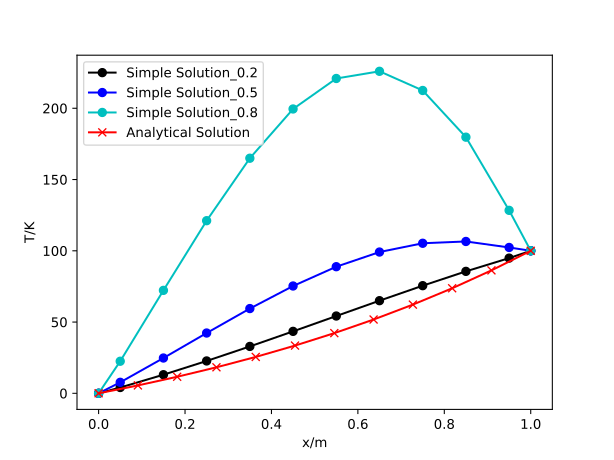
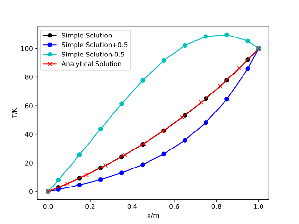

# 1. “四项法则”基本内容

&emsp;&emsp;在离散化微分方程的过程中，对于分布函数的不同选择会导致产生各种离散化方程的可能性。尽管在增加网格节点的情况下，这些不同形式的方程趋向于收敛到相同的解，但这并不意味着离散方程自动地满足物理真实性和整体平衡。为了确保离散方程的解始终遵循物理规律，需要遵循四项基本原则。这些原则是确保离散方程在逼近连续微分方程时保持稳定性、准确性、一致性和适应性。

## 1.1 法则一：控制容积面上的连续性原则

&emsp;&emsp;法则一的基本内容为：当一个面作为两个相邻控制容积的公共面时，在这两个控制容积的离散化方程内必须用相同的表达式来表示通过该面的热流密度，质量通量及动量通量。

## 1.2 法则二：正系数原则

&emsp;&emsp;在大多数的实际问题中，某个网格节点处的因变量值只是通过对流以及扩散的过程才受到相邻节点上值的影响。在其它条件不变时，在一个网格节点处该因变量值的增加应导致相邻网格节点上值的增加。该原则要求待求变量前的系数必须具有相同的符号，这样就保证了一个网格对下一个网格的影响总是正的。

## 1.3 法则三：源项的负斜率线性化原则

&emsp;&emsp;即使原则二要求所有相邻节点的系数为正，但是由于中心网格的系数需要减去源项线性化的系数，若源项线性系数较大时，中心节点的系数仍有可能变为负值，为了避免这种情况，要求源项线性化系数为负数。

## 1.4 法则四：相邻节点系数之和原则

&emsp;&emsp;当控制方程只包含因变量的导数项时，对于因变量变化一个常数时，仍会满足微分方程，要求所对应的离散方程也要满足。

# 2. “四项法则”的验证

## 2.1 基本理论

&emsp;&emsp;以一维对流扩散方程为例，通过自编程计算验证说明“四项法则”的正确性。一维对流扩散方程为：

$$
\frac{\partial \phi}{\partial t} + \frac{\partial}{\partial x}\left( \rho u \phi \right) = \frac{\partial}{\partial x}\left( \Gamma \frac{\partial \phi}{\partial x} \right)
$$

&emsp;&emsp;考虑稳态方程，则方程可化简为：

$$
\frac{\partial}{\partial x}\left( \rho u \phi \right) = \frac{\partial}{\partial x}\left( \Gamma \frac{\partial \phi}{\partial x} \right)
$$

&emsp;&emsp;由连续性方程：

$$
\frac{\partial \rho u}{\partial x} = 0 \Rightarrow \rho u = const
$$

$$
\left( \rho u \phi \right)_{e} - \left( \rho u \phi \right)_{w} = \left( \Gamma \frac{\partial \phi}{\partial x} \right)_{e} - \left( \Gamma \frac{\partial \phi}{\partial x} \right)_{w}
$$

&emsp;&emsp;用分段线性分布来表示：

$$
\frac{1}{2}\left( \rho u \right)_{e}\left( \phi_{E} + \phi_{P} \right) - \frac{1}{2}\left( \rho u \right)_{w}\left( \phi_{P} + \phi_{W} \right) = \Gamma_{e}\frac{\phi_{E} - \phi_{P}}{\left( \delta x \right)_{e}} - \Gamma_{w}\frac{\phi_{P} - \phi_{W}}{\left( \delta x \right)_{w}}
$$

&emsp;&emsp;引入两个重要符号：

$$
F \equiv \rho u
$$

$$
D = \frac{\Gamma}{\delta x}
$$

&emsp;&emsp;分别表示对流的强度和扩散传导性。

&emsp;&emsp;则离散方程可化为：

$$
a_{P}\phi_{P} = a_{E}\phi_{E} + a_{W}\phi_{W}
$$

&emsp;&emsp;式中：

$$
a_{E} = D_{e} - \frac{1}{2}F_{e}
$$

$$
a_{W} = D_{w} + \frac{1}{2}F_{w}
$$

$$
a_{P} = D_{e} + \frac{1}{2}F_{e} + D_{w} - \frac{1}{2}F_{w} = a_{E} + a_{W} + \left( F_{e} - F_{w} \right)
$$

## 2.2 参数设置

&emsp;&emsp;取 $\lbrack 0,L\rbrack \times \lbrack 0,t\rbrack$ 的时空域范围，将 $L$ 划分为 $n_{L}$ 个均匀分段，共 $n_{L} + 2$ 个节点。计算温度 $T$ 在一维空间内的分布情况，进行“四项法则”的验证。

&emsp;&emsp;初始参数取值如下表：

|     参数      |         值         |
|:-------------:|:------------------:|
| $T_0$ |        0 K         |
| $T_L$ |       100 K        |
|       $L$       |        1 m         |
|       $u$       |        1 m/s        |
|      $\rho$      | 1 kg/m<sup>3</sup> |
|       $D$       |     1 kg/(m·s)     |
| $n_L$ |         10         |

## 2.3 程序代码（Python）

```python
import numpy as np
import matplotlib.pyplot as plt

def exact(F, n):
    Tao = 1
    P = F/Tao
    x = np.linspace(0, 1, n + 2)
    Y = 100 * (np.exp(P * x) - 1) / (np.exp(P) - 1)
    return Y

def simple(F, n):  # 法则三与法则四通过改变此函数参数验证
    T = np.zeros(n + 2)
    T[0] = 0
    T[n + 1] = 100
    D = 10
    Tao = 1
    aW = np.zeros(n)
    aE = np.zeros(n)
    Su = np.zeros(n)
    SP = np.zeros(n)
    aE[0] = D - F/2
    SP[0] = -(2*D + F)
    Su[0] = (2*D + F) * T[0]

    for i in range(1, n - 1):
        aW[i] = D + F/2
        aE[i] = D - F/2
        Su[i] = 0
        SP[i] = 0
    aW[n - 1] = D + F/2
    aE[n - 1] = 0
    SP[n - 1] = -(2*D - F)
    Su[n - 1] = (2*D - F) * T[n + 1]
    aP = aW + aE - SP
    A = np.diag(-aP) + np.diag(aW[1:], k=-1) + np.diag(aE[:-1], k=1)
    t = np.linalg.solve(A, -Su)
    T[1:-1] = t
    return T

# 验证法则一
def law_1(m):
    T1 = np.zeros(m + 2)
    T1[0] = 0
    T1[m + 1] = 100
    dT = (T1[m + 1] - T1[0]) / m
    T1[1] = T1[0]
    for i in range(2, m + 1):
        T1[i] = T1[i-1] + dT
    Y1 = T1[1:m+2]
    X1 = np.linspace(0, 1, m + 1)
    return X1, Y1

X1, Y1 = law_1(5)
X2, Y2 = law_1(20)
X3, Y3 = law_1(100)

n = 10
F = 1
Y = exact(F, n)
T = simple(F, n)

# Plotting
X = (0, 0.05, 0.15, 0.25, 0.35, 0.45, 0.55, 0.65, 0.75, 0.85, 0.95, 1)
Xe = np.linspace(0, 1, n + 2)
plt.figure()
plt.plot(X, T, 'k-o', label='Simple Solution')
plt.xlabel('x/m')
plt.ylabel('T/K')
plt.plot(Xe, Y, 'r-x', label='Analytical Solution')
plt.step(X1, Y1, where='mid', linestyle='-', color='g', label='Stairs_5')
plt.step(X2, Y2, where='mid', linestyle='-', color='b', label='Stairs_20')
plt.step(X3, Y3, where='mid', linestyle='-', color='c', label='Stairs_100')
plt.legend(loc='upper left')
plt.savefig('law1.svg', format='svg', dpi=600)
plt.show()

# 验证法则二
n = 10
F = 50
Y = exact(F, n)
T = simple(F, n)
# Plotting
X = (0, 0.05, 0.15, 0.25, 0.35, 0.45, 0.55, 0.65, 0.75, 0.85, 0.95, 1)
Xe = np.linspace(0, 1, n + 2)
plt.figure()
plt.plot(X, T, 'k-o', label='Simple Solution')
plt.xlabel('x/m')
plt.ylabel('T/K')
plt.plot(Xe, Y, 'r-x', label='Analytical Solution')
plt.legend(loc='upper left')
plt.savefig('law2.svg', format='svg', dpi=600)
plt.show()
```

## 2.4 验证结果

### 2.4.1 法则一

&emsp;&emsp;在相邻节点之间采用阶梯式分布型线，此时违背法则一。所得到的计算结果显示出与解析解结果相较较大的差异。即便将网格数量增加至20、100个，所得结果如图所示，这表明即便增加网格数量，也无法使阶梯型分布的结果趋近于真实值。因此，离散化方程需满足在控制容积界面上通量的连续性要求。



### 2.4.2 法则二

&emsp;&emsp;增大 $F_{e}$ 至50，使 $a_{E} = D_{e} - \frac{1}{2}F_{e}$ 为负，此时不满足法则二，此时计算结果如下图黑色线所示，可以看到与红色的解析解有着很大的偏离。



### 2.4.3 法则三

&emsp;&emsp;分别改变中间各个节点的源项值至0.2、0.5、0.8，此时违背法则三，可以看到当中间节点考虑源项时如下图所示，计算结果偏离解析解。



### 2.4.4 法则四

&emsp;&emsp;将系数 $a_{P}$ 加减0.5，此时不满足法则四，可以看到结果相对于解析解差距很大。


