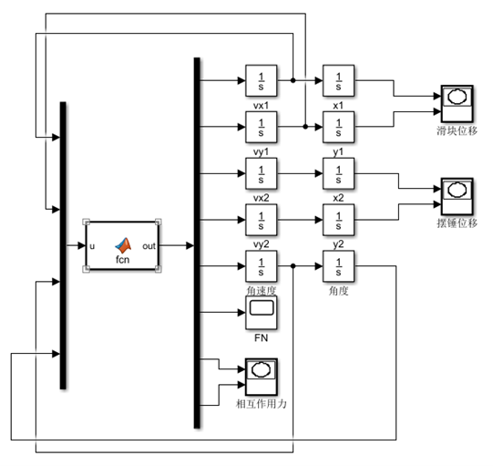
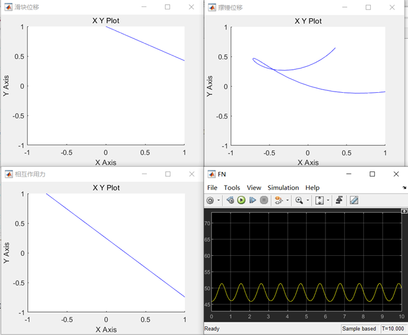

# 1. 实验分析

&emsp;&emsp;研究对象为一个在摩擦系数为$\mu$的斜面上运动的滑动摆；滑块A的质量为$m_1$，一个单摆悬挂在滑块上，单摆长度为$l$,摆锤质量为$m_2$，整个系统可以在同一竖直平面内运动。研究整个系统的运动（滑块运动和摆锤的运动轨迹）。

&emsp;&emsp;解决此多自由度刚体系统，最直接的途径就是把系统拆成滑块和摆锤单个系统，针对每个刚体的运动类型列出相应的动力学方程，并补充相应的能约束条件的运动学方程（滑块只能沿斜面运动，摆锤和滑块的位置关系）。

# 2. 求解思路

&emsp;&emsp;以滑块为研究对象，滑块沿斜面平移，可列方程：
$$
F_Nsin\alpha-\sigma\mu F_Ncos\alpha-F_{12x}=m_1\ddot{x}_1
$$

$$
F_Ncos\alpha-m_1g+\sigma\mu F_Nsin\alpha-F_{12y}=m_1\ddot{y}_1
$$

&emsp;&emsp;以摆锤为研究对象，摆锤作平面运动，可列方程：
$$
F_{12x}=m_2\ddot{x}_2
$$

$$
F_{12y}-m_2g=m_2\ddot{y}_2
$$

$$
-lcos\beta F_{12y}+lsin\beta F_{12x}=J\ddot{\beta}
$$

&emsp;&emsp;滑块运动学方程：
$$
\ddot{x}_1tan\alpha=-\ddot{y}_1
$$
&emsp;&emsp;摆锤运动学方程：
$$
\ddot{y}_1-\ddot{y}_2+l(cos\beta)\ddot{\beta}=l\dot{\beta}^2sin\beta
$$

$$
\ddot{x}_1-\ddot{x}_2+l(sin\beta)\ddot{\beta}=l\dot{\beta}^2cos\beta
$$

&emsp;&emsp;整理动力学方程和补充的运动学方程，可以得到由八个方程所组成的线性方程组。给定初始条件和参数，利用matlab中的simulink，带入求解。

# 3. Simulink建模框图、程序及运行结果

&emsp;&emsp;建模框图：



&emsp;&emsp;程序：

```matlab
function out = fcn(u)
m1=5;m2=0.5;alpha=pi/6;l=0.5;
j=0.01;
g=9.8687;
mu=0.5;
sdot=u(1)*cos(alpha)-u(2)*sin(alpha);
if sdot>0
sigma=1.0;
else
sigma=-1.0;
end
a=zeros(8,8);
a=[m1 0 0 0 0 sigma*mu*cos(alpha)-sin(alpha) l 0;
0 m2 0 0 0 -sigma*mu*sin(alpha)-cos(alpha) 0 l;
0 0 m2 0 0 0 -l 0;
0 0 0 m2 0 0 0 -l;
0 0 0 0 j 0 -l*sin(u(4)) l*cos(u(4));
l 0 -l 0 -l*sin(u(4)) 0 0 0;
0 l 0 -l l*cos(u(4)) 0 0 0;
sin(alpha) cos(alpha) 0 0 0 0 0 0]
b=[0;-m1*g;0;-m2*g;0;l*u(3)*u(3)*cos(u(4));l*u(3)*u(3)*sin(u(4));0]
out=inv(a)*b;
```

&emsp;&emsp;运行结果：



# 4. 实验结果的分析和讨论

&emsp;&emsp;滑块的位移符合实际情况，轨迹为一条沿斜面的直线。摆锤的运动为平面运动，轨迹为复杂的曲线。斜面对滑块的作用力发生正弦变化，这正是由于摆锤对滑块的作用力变化导致的结果。

# 5. 实验心得体会

（1）simulink的仿真功能对于工科的学习有很大帮助，之后可以应用到关于机械设计的许多领域。比方说在用solidworks画图之后，我们可以先用仿真系统测试它的性能，如果有问题及时调整，而不是只能在制作出实体以后才发现问题，这大大减少了对于材料和时间的消耗。

（2）采用MATLAB附带的图形仿真工具Simulink实现了对于滑块和摆锤运动轨迹分析，对matlab有了进一步的了解。

（3）会利用了simulink模拟力学中一些物体运动，更好的解决问题。