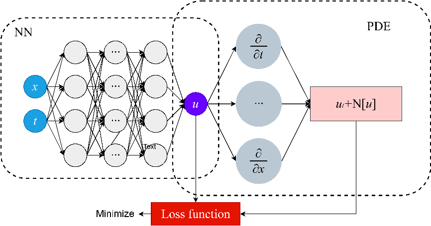
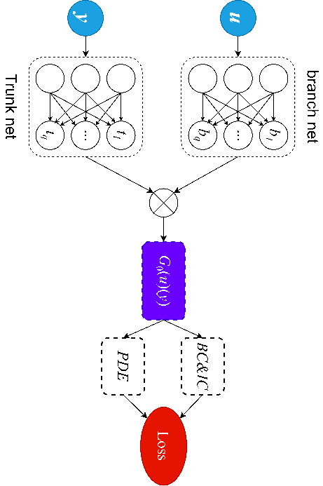

**摘 要** 在科学工程领域，富含物理信息多尺度系统的建模和动力学预测一直是研究的前沿热点问题。流体动力系统的演化含多尺度特征以及非线性的相互作用，可用流动控制方程进行准确地描述。传统的数值求解方法（如有限差分法）在求解流动问题时具有求解速度较慢、不具有泛化性的问题；深度学习方法则预测速度较慢、准确性较差。因此，迫切需要一种可以将流动控制方程与深度学习相结合的方法，来提升模型的预测速度和泛化性。物理信息神经网络（PINN）首次基于深度学习框架融合了流动物理的方程约束以及初边值条件的数据约束来求解流动的正、反问题，但其仅限于一个流动方程的求解而不具有泛化性能。物理信息深度算子网络（PI-DeepONet）通过无限维的映射突破了PINN泛化性能差的瓶颈。本文对国内外学者在这一领域的研究现状进行了深入调研，全面介绍了PINN和PI-DeepONet的基本理论、算法应用和未来展望。综合来看，PINN和PI-DeepONet在解决实际问题、推动科学发展和促进技术创新方面具有广阔的前景，可以为相关领域的研究和应用提供新的思路和工具。

**关键词** 物理信息神经网络；物理信息深度算子网络；有限差分；计算流体力学；参数化方程

**ABSTRACT** In the field of science and engineering, the modeling and dynamic prediction of multi-scale systems, which are rich in physical information, have emerged as a prominent area of research. Describing the evolution of fluid dynamic systems with multi-scale characteristics and nonlinear interactions accurately can be achieved through the utilization of flow governing equations. However, traditional numerical solution methods, such as finite difference method, encounter limitations in terms of slow computing speeds and lack of generalizability when dealing with fluid flow problems. Conversely, deep learning methods often exhibit sluggish prediction speeds and low accuracy. Hence, there is an urgent need for an approach that integrates prior flow governing equations with deep learning techniques to enhance the prediction speed and generalizability of the models. Physics-Informed Neural Networks (PINN) is firstly proposed to integrate the flow governing equations and data constraints of initial and boundary conditions to solve both forward and inverse problems with a deep learning framework. However, it is limited to solving a single flow governing equation and lacks generalizability. Physics-Informed Deep Operator Networks (PI-DeepONet) overcomes the bottleneck of poor generalization performance in PINN by leveraging an infinite-dimensional mapping. In this paper, we conducted an in-depth investigation of the research status in this field by domestic and international scholars, providing a comprehensive introduction to the basic theory, algorithm application, and future prospects of PINN and PI-DeepONet. In summary, PINN and PI-DeepONet hold broad prospects in solving practical problems, advancing scientific development, and promoting technological innovation. They can provide new ideas and tools for research and applications in related fields.

**KEY WORDS:** Physics-informed neural networks; Physics-informed deep operator networks; Approximation theory; Numerical solution; Parameterized equations

# 研究背景及意义

在科学工程领域，处理富含物理信息的多尺度系统的建模和动力学预测一直是一项重大挑战。这些系统的特点是具有多个尺度和相互作用，并且其行为受到物理定律的支配。为了解决这些问题，研究人员需要求解描述这些系统的偏微分方程（Partial differential equations, PDEs）。偏微分方程在工程领域中发挥着重要的作用。例如，在航空工程中，通过求解涉及空气流动和飞行器形状的偏微分方程，可以预测飞机的气动性能[1]。在船舶设计中，偏微分方程的应用可以帮助工程师理解流体在船体周围的行为，从而优化船舶的流体力学特性[2]。此外，偏微分方程还可以应用于气象学领域，通过模拟大气中的运动和相互作用，实现天气模式的模拟和预测[3]。偏微分方程为我们提供了一种数学语言，用于描述和解释自然现象中涉及的物理过程。通过建立适当的偏微分方程模型，并应用数值求解方法，研究人员可以预测和优化系统的行为。这种方法为工程师提供了一种有力的工具，用于理解和控制复杂系统的行为，从而推动科学工程领域的进步。

复杂的偏微分方程往往难以获得显式解析解。为了近似求解这些方程，研究者们开发了多种数值方法。这些传统数值方法在科学工程领域得到了广泛应用，其核心思想是将具有无限维度的算子通过离散化转化为有限维度的近似问题。传统数值方法的基本原理是将复杂的时空区域划分为小而简单的区域，以便计算机进行处理。通过在这些离散的区域上构建数值逼近，数值方法能够在有限的计算资源下近似求解偏微分方程。这种离散化的方法使得问题的处理变得可行，并且能够处理更大规模的计算。这些传统数值方法被广泛应用于解决各种类型的偏微分方程，涵盖了静态和动态问题。例如，在热力学和计算流体力学领域，常见的数值方法包括有限差分法（FDM）[4]和有限体积法（FVM）[5]，它们通过将连续的物理域离散为离散的网格点，将偏微分方程转化为代数方程组进行求解。而有限元法（FEM）[6]则在结构分析等领域广泛应用，通过将物理域离散为有限数量的单元，利用多项式逼近来近似原始方程。传统数值方法的应用使得科学工程领域能够处理和解决复杂的偏微分方程问题，为研究和实际应用提供了强有力的工具和技术。

无网格方法相对于有网格方法打破了对网格的依赖，使得问题的离散化更加自由和灵活。传统的无网格方法，例如最小二乘法[7]，通常采用近似多项式逼近来进行数值求解。为了提高数值解的精度，某些方法还会使用高阶高斯积分等技术[8]。然而，这种精度的提升往往伴随着计算量的增加，导致传统无网格方法的计算复杂度超过有限元方法。在实际应用中，无论是有网格方法还是无网格方法，传统数值方法都存在一些不足之处。它们的适用范围有限，很难在计算速度和结果精度之间找到平衡。在对具有不均匀尺度的非线性系统进行建模和预测时，传统数值方法的效果受到限制。特别是当处理具有缺失、间隙或受到噪声影响的显式物理问题时，仅仅依靠传统方法解决几乎是不可能的。此外，将传统数值方法扩展到高维偏微分方程时，常常会遇到维数灾难问题[9]。这意味着随着维度的增加，计算复杂度呈指数级增长，使得传统数值方法难以应对高维问题的挑战。

1943年，Mcculloch和Pitts[10]提出了基于生物神经元的数学模型，即神经网络模型。这一创新为后来的神经网络研究奠定了基础。1948年，Turing[11]以Hebbian法则为基础提出了"BP图灵机"，进一步推动了神经网络的发展。1958年，美国心理学家Rosenblatt[12]提出了感知机算法，并于1963年证明了感知机的收敛定理[13]，引发了神经网络领域的第一次研究热潮。随后，1974年，Werbos[14]提出了反向传播算法，即BP（Back propagation）算法，为神经网络的训练提供了重要方法。1984年，Hinton提出了玻尔兹曼机，并在两年后提出了带有BP算法的多层感知器（Multilayer perceptron, MLP），将Sigmoid函数作为网络的激活函数，克服了感知机在处理非线性问题[15]方面的限制。1989年，Hecht[16]提出了MLP的万能逼近定理，并给出了相应的证明，这使得神经网络领域再次蓬勃发展。在这之后，卷积神经网络之父Lecun[17]提出了可用于数字识别的卷积神经网络。2006年Hinton和Salakhutdinov[18]解决了多层网络中的梯度消失问题，提出了现今广为人知的深度学习方法（Deep learning）。

近年来，随着GPU等高性能计算设备的快速发展、海量数据的轻松获取以及各种先进算法的设计，机器学习特别是深度学习在计算机视觉、推荐系统、医疗诊断和天气预测等领域取得了显著成效[19], [20]。科学机器学习（Scientific machine learning, SciML）是一个新的研究方向，利用神经网络的强大的表示能力来表征物理问题的偏微分方程[21]。与此同时，科学家们开始将这些数据驱动的方法应用于更广泛的计算科学领域，包括计算流体力学[22-24]等。

深度学习方法能够处理系统中极其复杂的非线性关系，因此可以构造这样一个替代模型用于建模由PDEs控制的流体动力学过程。但深度学习为流体力学系统带来了新的不确定性和其它一些缺点。缺点之一便是经典深度学习方法的收集观测数据的能力远大于正确理解数据的能力[25]，更不用说应用数据了。当前的大多数深度学习方法无法从数据洪流中提取可用的信息。此外，如果想要用深度学习来实现对复杂物理系统的精确建模通常需要庞大的数据样本。然而现实中想要获取如此庞大的数据通常所耗费的成本是极高的，甚至是不可行的。例如，一次风洞实验往往需要大量的人力物力，而这只能为深度学习模型提供一组样本。因此在这些应用中传统的纯数据驱动模型往往是极不现实的。另外，即使是拿到了所有的相关数据，这种纯数据驱动的模型可能非常适合观测结果，但预测结果可能在物理上与其不一致。也就是说，只是简单地将深度学习算法作为黑盒模型时，训练后的结果通常缺乏物理上的可解释性。

因此，我们迫切需要通过“教授”机器学习模型相关的物理规则来整合基本物理定律和领域知识，反之又可以为该学习模型提供“信息先验”，即在观测规则的基础上赋予强大的理论约束。为此，当前需要基于物理信息的学习方法，可以利用我们对世界的观察、经验、物理或数学理解中的先验知识来提高学习算法的性能。科学工程领域的物理信息包括物理定律（如能量守恒、质量守恒）、基本物理量约束（如密度值为正数）、时间和空间上的对称量、已有科学研究的数据库等。因此，这种使用相对少量数据的内嵌物理信息的神经网络便应运而生。

# 国内外研究现状

物理信息神经网络（Physics-informed neural networks, PINN）是Raissi[26]于2017年提出的，该算法继承了深度神经网络的函数逼近能力[27], [28]，直接利用自动微分来处理问题，同时能灵活地将已知的物理信息嵌入网络。这种物理信息神经网络的损失函数通常由PDEs的残差项和给定边界值的拟合项组成。神经网络通过最小化这一损失函数来优化模型。这种物理信息神经网络对高维问题、反问题以及不规则区域的求解取得了突破性的成果。Meng[29]提出了并行的PINN算法，并求解了微分方程的反问题。Yang等[30]将基于贝叶斯的PINN用于研究偏微分方程的正、反问题。Mishra等[31]研究了PINN的泛化误差，并对PINN的结构进行了敏感性分析。Wang等[32]对PINN的训练过程进行了深度优化，并证明了对PINN进行的一系列调整能够更方便地处理数据。此外，PINN算法已经被成功地用来解决解决科学工程领域的大量复杂建模问题，比如流体力学[33], [34]、材料设计[35]、金属裂缝检测[36]、电力系统动力学问题[37]、低分辨率图像重构[38]、生物医学工程[39]、地震波预测[40]、疾病传播[41]等。

现今的物理信息神经网络只能建立一种初始条件（边界条件或源项）到物理解的映射，因而不具有泛化到其他初始条件（边界条件或源项）所对应的物理解的能力。迁移学习可以一定程度上减弱上述限制，但仍需要对新模型进行训练。在实际的工业应用中，研究人员需要对不同可能性的输入条件（载荷、初边值条件等）并进行实时的响应，物理信息神经网络因其缺少泛化能力无法而完成上述工程问题的优化、控制。Wang等[42]在PINN基础上提出了利用深度算子网络（Deep operator networks, DeepONet）来替换PINN中的传统神经网络架构。这种深度算子网络以通用算子逼近定理[43]为理论基础，通过学习算子来近似控制方程。该架构的神经网络分为“主干”和“分支”两个网络，分别用于提取输入函数和输入坐标。这个新的方法有效解决了PINN在面对变化和缺失的初始和边界条件时预测时间慢的问题。在新的架构下，针对特定物理问题的预测速度加快了约三个数量级。深度神经算子网络可以建立从初始条件（边界条件或源项）到数值解的无限维映射，和传统的有限维映射的神经网络相比在同等数据集大小的条件下具有更优异的泛化能力，即更小量级的训练误差以及测试误差。Lu等[44]通过提供一些加速训练的特殊功能设计出一种更快速的深度算子网络。Howard等[45]系统证明了低保真数据的存在可以改善深度算子网络的预测速度与精度。

然而，深度算子网络是基于数据驱动进行的流场求解或预测，需要大量的数据样本进行训练方能有效降低测试误差。上述已经说明了数据获取在科学工程领域的问题，因此我们仍旧需要将深度算子网络与物理信息进行结合，这便是物理信息深度算子网络（Physics-informed deep operator networks, PI-DeepONet）。Wang等[46]说明了这种算法在快速预测各种类型的参数偏微分方程的解方面的有效性。这种物理信息深度算子网络可以在没有任何成对输入输出数据（只知晓控制方程与初始边界条件）的情况下进行准确的预测。物理信息深度算子网络正逐渐被应用于求解各种复杂的工程问题，比如Zheng等[47]用其来推断锂离子电池的电化学性能和参数；Osorio等[48]用其来预测瞬态运行下的太阳能-热力系统性能。

# 拟开展的工作

利用物理信息神经网络（PINN）与物理信息深度算子网络（PI-DeepONet）研究偏微分方程的求解，对一些简单的物理问题及流动问题进行了建模和求解，具体内容如下：

1.  首先进行文献调研工作，了解背景及数据与物理信息结合的必要性。同时调研物理信息神经网络和物理信息深度算子网络的当前研究现状。

2.  深入认真学习本文所涉及的基础理论。在实际工作方面以PINN方法为基础，应用于一些简单的物理问题，对其求解结果进行说明，同时探讨PINN在预测方面的优点和缺点，揭示其在不同问题上的适用性和局限性

3.  以PI-DeepONet方法为主题，应用于一系列物理问题的求解。对PI-DeepONet在预测等方面的优劣进行分析和讨论，凸显其相对于其他方法的特点和优越性。

4.  进行总结和展望。

# 具体方案

## PINN算法

PINN的结构如图 1所示，在PINN算法中，前馈神经网络被视为基本逼近单元，其中函数的自变量被传递给输入层的神经元。网络输出代表对偏微分方程的近似解。与传统的神经网络不同，物理信息神经网络由两个部分构成：第一部分是前馈神经网络，其任务是计算偏微分方程的因变量；第二部分是反映物理信息的神经网络，其职责是计算物理量关于因变量的各阶导数。为了确保神经网络计算结果符合物理定律，PINN算法将偏微分方程的残差以及初始、边界条件嵌入损失函数作为惩罚约束项。

图 1 PINN模型

Fig. 1 PINN model

首先给出一般形式的偏微分方程如下：

$$
u_{t}+ \mathcal{N}\lbrack u\rbrack = 0\tag{1}
$$

这里，$u\left( t,\mathbf{x} \right)$表示偏微分方程的物理量，表现为关于时间空间*x*与时间*t*的函数，$\mathcal{N}\lbrack u\rbrack$表示对物理量*u*施加非线性算子。定义$f(t,\mathbf{x})$由方程的左边给出：

$$
f := u_{t}+ \mathcal{N}\lbrack u\rbrack\tag{2}
$$

PINN算法的损失函数如下：

$$
\mathcal{L} :=\mathcal{L}_{u} + \mathcal{L}_{f}\tag{3}
$$

$$
\mathcal{L}_{u} = \frac{1}{N_{u}}\sum_{i = 1}^{N_{u}}\left| u\left( t_{u}^{i},x_{u}^{i} \right) - u_{NN} \right|^{2}\tag{4}
$$

$$
\mathcal{L}_{f} = \frac{1}{N_{f}}\sum_{i = 1}^{N_{f}}\left| f\left( t_{f}^{i},x_{f}^{i} \right) \right|^{2}\tag{5}
$$

式中$\mathcal{L}_{u}$为初边值训练数据损失，$N_{u}$为初始和边界训练数据数。$\left\{ u\left( t_{u}^{i},x_{u}^{i} \right) \right\}_{i = 1}^{N_{u}}$表示初始以及边界处的观测数据，$u_{NN}$表示初始与边界处与观测数据对应的预测值；$\mathcal{L}_{f}$为物理约束方程损失，$\ N_{f}$为控制方程采样点数；$\left\{ f\left( t_{f}^{i},x_{f}^{i} \right) \right\}_{i = 1}^{N_{f}}$表示对控制方程进行采样，由LHS抽样方法给出。

可以看到，PINN算法的损失函数由两部分构成，第一部分为初始与边界条件的训练数据损失，用来描述模型在初始与边界上的预测拟合程度。第二部分为物理约束方程的损失，用来描述整个预测场内部对控制方程的吻合程度。

## PI-DeepONet算法

根据算子通用逼近定理，神经网络可以作为一个通用逼近器来近似非线性算子。DeepONet通过适当的离散化和优化方法，可以将连续的算子转化为离散形式，并通过最小化损失函数来调整网络参数。这样，DeepONet能够以任意精度逼近偏微分方程中的非线性算子，从而提供近似解。

深度算子网络的输入由两个独立的部分$\left\lbrack \mathbf{u}\left( \mathbf{x}_{1} \right)\mathbf{,u}\left( \mathbf{x}_{2} \right)\mathbf{,\cdots,u}\left( \mathbf{x}_{m} \right) \right\rbrack$和***y***组成，因此深度算子网络的结构分为两部分：第一部分为主干网络，它以时空坐标***y***为输入；第二部分为分支网络，分支网络以$\left\lbrack \mathbf{u}\left( \mathbf{x}_{1} \right)\mathbf{,u}\left( \mathbf{x}_{2} \right)\mathbf{,\cdots,u}\left( \mathbf{x}_{m} \right) \right\rbrack$作为输入。然后将主干与分支网络的输出通过点积合并在一起：

$$
G_{\theta}\left( \mathbf{u} \right)\left( \mathbf{y} \right) = \sum_{k = 1}^{q}\underbrace{b_{k}\left( \mathbf{u}\left( \mathbf{x}_{1} \right),\mathbf{u}\left( \mathbf{x}_{2} \right),\cdots,\mathbf{u}\left( \mathbf{x}_{m} \right) \right)}_{branch}\underbrace{t_{k}\left( \mathbf{y} \right)}_{trunk}\tag{6}
$$

这里$G_{\theta}\left( \mathbf{u} \right)\left( \mathbf{y} \right)$表示解的映射，其中$\theta$表示网络中所有可训练的参数。$\mathbf{u}\left( \mathbf{x}_{1} \right),\mathbf{u}\left( \mathbf{x}_{2} \right),\cdots,\mathbf{u}\left( \mathbf{x}_{m} \right)$表示函数***u***在固定位置$\left\{ x_{i} \right\}_{i = 1}^{m}$处的值。同时，与PINN相似，PI-DeepONet通过将偏微分方程作为惩罚约束项嵌入损失函数，以限制神经网络计算结果符合相关物理定律，如图 2。

图 2 PI-DeepONet模型

Fig. 2 PI-DeepONet model

深度算子网络的损失函数如下：

$$
\mathcal{L}(\theta) = \mathcal{L}_{Operator}(\theta) + \mathcal{L}_{Physics}(\theta)\tag{7}
$$

$$
\mathcal{L}_{Operator}(\theta) = \frac{1}{NP}\sum_{i = 1}^{N}{\sum_{j = 1}^{P}\left| G_{\theta}\left( \mathbf{u}^{(i)} \right)\left( \mathbf{y}_{u,j}^{(i)} \right) - G\left( \mathbf{u}^{(i)} \right)\left( \mathbf{y}_{u,j}^{(i)} \right) \right|^{2}}\tag{8}
$$

$$
\mathcal{L}_{Physics}(\theta) = \frac{1}{NQm}\sum_{i = 1}^{N}{\sum_{j = 1}^{Q}{\sum_{k = 1}^{m}\left| \mathcal{N}\left( u^{(i)}\left( \mathbf{x}_{k} \right),G_{\theta}\left( \mathbf{u}^{(i)} \right)\left( \mathbf{y}_{f,j}^{(i)} \right) \right) \right|^{2}}}\tag{9}
$$

这里，$\mathcal{L}_{Operator}(\theta)$为网络的算子损失，$\mathcal{L}_{Physics}(\theta)$为方程约束损失。$\left\{ \mathbf{u}^{(i)} \right\}_{i = 1}^{N}$表示*N*个独立的输入函数。对每个$\mathbf{u}^{(i)}$，$\left\{ \mathbf{y}_{u,j}^{(i)} \right\}_{j = 1}^{P}$是由数据观测值、初始或边界条件等决定的*P*个位置。$\left\{ u^{(i)}\left( \mathbf{x}_{k} \right) \right\}_{k = 1}^{m}$表示每一个独立函数在共*m*个点$\left\{ \mathbf{x}_{k} \right\}_{k = 1}^{m}$处的函数值，$\left\{ \mathbf{y}_{f,j}^{(i)} \right\}_{j = 1}^{Q}$是在$G\left( \mathbf{u}^{(i)} \right)$域内的随机的控制方程的*Q*个采样点位置。

## 训练数据生成

在PINN的训练中，通常需要两类数据：PDEs的初始和边界条件数据与PDEs的内部约束数据。

初始和边界条件数据用于确保神经网络在边界上能够准确地满足给定的边界条件。边界条件数据包括输入变量（如空间坐标和时间）以及相应的目标值（根据边界条件计算得出的预期输出）。内部约束数据用于约束神经网络在整个域内的行为，使其能够准确地近似PDEs的解。内部约束数据包括在问题域内的随机选择的点，通过拉丁超立方抽样生成的。对于每个内部数据点，输入变量（如空间坐标和时间）被提供，并根据PDEs的解进行目标值的计算。

采用MATLAB程序对研究对象方程进行传统有限差分方法求解，一方面利用生成的解矩阵中的初始和边界条件直接导入PINN作为边界条件数据，另一方面所计算的解作为参考解与PINN的预测值进行对比，以判断PINN的预测准确性。对于内部约束数据，通过调用pyDOE库中的lhs函数，直接对内部约束数进行抽样以生成内部数据。

PI-DeepONet的训练数据集是一个三元组，结构如下：

$$
\left\lbrack \mathbf{u},\mathbf{y},G\left( \mathbf{u} \right)\left( \mathbf{y} \right) \right\rbrack = \left\lbrack \begin{bmatrix}
 \vdots \\
\mathbf{u}^{(i)}\left( \mathbf{x}_{1} \right),\mathbf{u}^{(i)}\left( \mathbf{x}_{2} \right),\cdots,\mathbf{u}^{(i)}\left( \mathbf{x}_{m} \right) \\
\mathbf{u}^{(i)}\left( \mathbf{x}_{1} \right),\mathbf{u}^{(i)}\left( \mathbf{x}_{2} \right),\cdots,\mathbf{u}^{(i)}\left( \mathbf{x}_{m} \right) \\
 \vdots \\
\mathbf{u}^{(i)}\left( \mathbf{x}_{1} \right),\mathbf{u}^{(i)}\left( \mathbf{x}_{2} \right),\cdots,\mathbf{u}^{(i)}\left( \mathbf{x}_{m} \right) \\
 \vdots 
\end{bmatrix},\begin{bmatrix}
 \vdots \\
\mathbf{y}_{1}^{(i)} \\
\mathbf{y}_{2}^{(i)} \\
 \vdots \\
\mathbf{y}_{m}^{(i)} \\
 \vdots 
\end{bmatrix},\begin{bmatrix}
 \vdots \\
G\left( \mathbf{u}^{(i)} \right)\left( \mathbf{y}_{1}^{(i)} \right) \\
G\left( \mathbf{u}^{(i)} \right)\left( \mathbf{y}_{1}^{(i)} \right) \\
 \vdots \\
G\left( \mathbf{u}^{(i)} \right)\left( \mathbf{y}_{1}^{(i)} \right) \\
 \vdots 
\end{bmatrix} \right\rbrack\tag{10}
$$

每个输入函数$\mathbf{u}^{(i)} = \left\lbrack \mathbf{u}^{(i)}\left( \mathbf{x}_{1} \right),\mathbf{u}^{(i)}\left( \mathbf{x}_{2} \right),\cdots,\mathbf{u}^{(i)}\left( \mathbf{x}_{m} \right) \right\rbrack$重复了*P*次，$\left\{ \mathbf{u}^{(i)} \right\}_{i = 1}^{N}$是*N*个样本函数，对于每个样本$\mathbf{u}^{(i)}$，$G\left( \mathbf{u}^{(i)} \right)$在P个不同的位置$\left\{ \mathbf{y}^{(i)} \right\}_{i = 1}^{P} \subset \mathbb{R}^{d}$上求值，那么构成PI-DeepONet训练数据集$\mathbf{u},\mathbf{y},G\left( \mathbf{u} \right)\left( \mathbf{y} \right)$的张量维数分别为：$(N \times P,m),\ \ (N \times P,d),\ \ (N \times P,1)$。

## 参数设置

关于PINN的参数设置如表1：

表1 PINN参数设置

Table 1 Parameter settings for PINN

|             参数              |  值   |
|:-----------------------------:|:-----:|
| 初始和边界训练数据数$N_{u}$ |  100  |
|   控制方程采样点数$N_{f}$   | 10000 |
| 网络层数（不含输入与输出层）  |   8   |
|      网络每层神经元个数       |  20   |

本章中的PI-DeepONet所采用的激活函数均为Tanh函数，同时使用Adam优化器进行小批量梯度下降训练，批量大小为10000。关于网络的参数设置如表2：

表 2 PI-DeepONet参数设置

Table 2 Parameter settings for PI-DeepONet

|                参数                |  值  |
|:----------------------------------:|:----:|
| 用于训练的输入样本数$N_{train}$  | 900  |
|  用于测试的输入样本数$N_{test}$  | 100  |
|        输入样本采样点数量m         | 101  |
| 计算初始（边界）条件的位置点数量P  | 101  |
|      计算PDE残差的位置点数量Q      | 2500 |
| 主干网络层数（不包括输入与输出层） |  7   |
|       主干网络每层神经元个数       | 100  |
| 分支网络层数（不包括输入与输出层） |  7   |
|       分支网络每层神经元个数       | 100  |

为了便于计算，将空间坐标和时间坐标进行无量纲化放缩，即空间与时间坐标的范围为：*x*∈\[0,1\]，*t*∈\[0,1\]。总输入样本数量为1000，选取900个输入样本作为训练数据，对网络进行训练，其余100个样本作为测试样本对训练好的网络进行测试。在本节中，算子网络所建立的映射为初始条件至时空速度分布场的映射，选择随机的初始分布进行网络训练，并利用训练好的网络对任意的初始分布进行求解应用。

## 性能指标

用于评估模型性能的误差度量是相对$\mathbb{L}_{2}$范数。具体来说最后计算的误差为经过训练的神经网络模型在测试数据集中所有示例中的相对$\mathbb{L}_{2}$误差的平均值：

$$
\text{Error} = \frac{\sqrt{\sum_{i = 1}^{N}\left| u_{NN}\left( t^{i},x^{i} \right) - u\left( t^{i},x^{i} \right) \right|^{2}}}{\sqrt{\sum_{i = 1}^{N}\left| u\left( t^{i},x^{i} \right) \right|^{2}}}\tag{11}
$$

式中：*N*——测试数据集中离散的时空点数； $u_{NN}\left( t^{i},x^{i} \right)$——在点$\left( t^{i},x^{i} \right)$处的预测值； $u\left( t^{i},x^{i} \right)$——在点$\left( t^{i},x^{i} \right)$处的真实函数值。

## 初步选择的流动问题

伯格斯方程（Burgers equation）是一种非线性偏微分方程，它以物理学家Johannes Martinus Burgers的名字命名。Burgers方程广泛应用于流体力学、声学、气象学和其他领域中的波动现象建模，是一个模拟冲击波的传播和反射的非线性偏微分方程。Burgers方程的一维形式可以表示为：

$$
\frac{\partial u}{\partial t} + u\frac{\partial u}{\partial x} = \nu\frac{\partial^{2}u}{\partial x^{2}},\ \ \ (x,t) \in \lbrack 0,1\rbrack \times \lbrack 0,1\rbrack\tag{12}
$$

$$
u(x,0) = s(x),\ \ \ x \in \lbrack 0,1\rbrack\tag{13}
$$

式中，$u(x,t)$表示随空间与时间变化的速度场，$\nu$为粘性系数，取$\nu = 0.01/\pi$。同时方程受周期性边界条件约束：

$$
u(0,t) = u(1,t)\tag{14}
$$

$$
\frac{\partial u}{\partial x}(0,t) = \frac{\partial u}{\partial x}(1,t)\tag{15}
$$

Burgers方程结合了对流项（$u \bullet (\partial u/\partial x)$）和扩散项（$\nu \bullet (\partial^{2}u/\partial x^{2})$），因此既具有非线性特性，又包含了二阶空间导数。Burgers方程的解显示出多种现象，包括激波、涡旋形成和能量耗散。由于其非线性特性和多样的解行为，Burgers方程在流体动力学、混沌理论和非线性波动研究中具有重要的应用和理论意义。

# 未来展望

在PINN和PI-DeepONet领域的未来，仍有许多值得研究的问题。

首先，进一步改进和优化网络结构和算法。随着对PINN和PI-DeepONet的研究不断深入，我们可以期待更多创新的网络结构和算法被提出，以进一步提高模型的表示能力和学习能力。例如，引入注意力机制和图神经网络等新颖技术，有望增强模型对复杂物理现象的建模能力。

其次，加强与传统数值方法的融合与结合。尽管PINN和PI-DeepONet在求解偏微分方程中具有很大潜力，但传统的数值方法仍然在某些问题上具有优势。未来的研究可以探索将这些方法与PINN和PI-DeepONet相结合，构建更加高效和精确的求解框架。通过利用两者的优势互补，可以提高求解效率和精度。

第三，进一步扩展应用领域。PINN和PI-DeepONet在流体力学、材料科学和电磁学等领域已经展示出了巨大的潜力。未来的研究可以将这些方法应用于更广泛的科学和工程领域，如气象学、生物医学、地震学等，为解决实际问题提供新的可能性。

第四，提高模型的可解释性和可靠性。随着对PINN和PI-DeepONet的研究越来越深入，我们需要关注模型的可解释性和可靠性问题。未来的研究可以探索如何更好地解释模型的预测结果，理解网络学习到的物理现象，并提供相应的不确定性估计，增强模型的可靠性和可信度。

最后，加强跨学科合作和交流。PINN和PI-DeepONet的研究融合了物理学和深度学习等多个学科领域的知识和技术。未来的发展需要加强跨学科的合作和交流，促进物理学家、数学家、计算机科学家和工程师之间的合作，共同推动这一领域的发展。

综上所述，PINN和PI-DeepONet作为求解偏微分方程和物理学问题的新兴方法，在理论和应用方面都具有广阔的前景。通过持续的研究努力，我们可以期待这些方法在解决实际问题、推动科学发展和促进技术创新方面发挥更大的作用。

参考文献

\[1\] 刘彦超．四轴飞行器的欧拉动力学方程［J］．中阿科技论坛（中英阿文），2019，(02)：90-93＋121-124．

\[2\] 杨翠平．基于微分方程的船舶网络流量预测模型［J］．舰船科学技术，2020，42(18)：166-168．

\[3\] 李扬，刘玉宝，许小峰．基于深度学习改进数值天气预报模式和预报的研究及挑战［J］．气象科技进展，2021，11(03)：103-112．

\[4\] 齐清兰．有限差分法在计算流体力学中的应用［J］．河北工程技术高等专科学校学报，1994，(04)：44-48．

\[5\] 王全祥．流体力学中几类波方程的有限体积元方法［D］．南京师范大学，2013．

\[6\] 王文芳，杨刚，姜亚丽．基于BIM的桥梁有限元模型转换与结构分析方法［J］．大连海事大学学报，2021，47(03)：111-119．

\[7\] 王琳琳，卢玫，黄鉴．基于最小二乘法预测的导热反问题求解［J］．化工学报，2016，67(S1)：103-110．

\[8\] 张庆礼，王晓梅，殷绍唐，等．高阶高斯积分节点的高精度数值计算［J］．中国工程科学，2008，(02)：35-40．

\[9\] Chen L. Curse of dimensionality \[M\]//Liu L, Özsu M T. Encyclopedia of Database Systems. Boston, MA: Springer US, 2009: 545-546.

\[10\] Mcculloch WS, Pitts W. A logical calculus of the ideas immanent in nervous activity \[J\]. The Bulletin of Mathematical Biophysics, 1943, 5(4): 115-133.

\[11\] Turing A. Intelligent machinery (1948) \[M\]. 2004.

\[12\] Rosenblatt F. The perceptron: A probabilistic model for information storage and organization in the brain \[J\]. Psychological Review, 1958, 65: 386-408.

\[13\] Rosenblatt F. Principles of neurodynamics. perceptrons and the theory of brain mechanisms \[J\]. American Journal of Psychology, 1963, 76: 705.

\[14\] Werbos PJ. Beyond regression: New tools for prediction and analysis in the behavioral sciences \[M\]. Harvard University, 1975.

\[15\] Lecun Y, Boser B, Denker JS, et al. Backpropagation applied to handwritten zip code recognition \[J\]. Neural Computation, 1989, 1(4): 541-551.

\[16\] Hecht N. Theory of the backpropagation neural network \[C\]// International 1989 Joint Conference on Neural Networks. 1989: 593-605.

\[17\] Lecun Y, Bottou L, Bengio Y, et al. Gradient-based learning applied to document recognition \[J\]. Proceedings of the IEEE, 1998, 86(11): 2278-2324.

\[18\] Hinton GE, Salakhutdinov RR. Reducing the dimensionality of data with neural networks \[J\]. Science, 2006, 313(5786): 504-507.

\[19\] Lecun Y, Bengio Y, Hinton G. Deep learning \[J\]. Nature, 2015, 521(7553): 436-444.

\[20\] Ravuri S, Lenc K, Willson M, et al. Skilful precipitation nowcasting using deep generative models of radar \[J\]. Nature, 2021, 597(7878): 672-677.

\[21\] Rackauckas C, Ma Y, Martensen J, et al. Universal differential equations for scientific machine learning \[M\]. 2020.

\[22\] Bar-Sinai Y, Hoyer S, Hickey J, et al. Learning data-driven discretizations for partial differential equations \[J\]. Proceedings of the National Academy of Sciences, 2019, 116(31): 15344-15349.

\[23\] Carleo G, Cirac I, Cranmer K, et al. Machine learning and the physical sciences \[J\]. Reviews of Modern Physics, 2019, 91(4): 045002.

\[24\] Brunton SL, Noack BR, Koumoutsakos P. Machine learning for fluid mechanics \[J\]. Annual Review of Fluid Mechanics, 2020, 52(1): 477-508.

\[25\] Reichstein M, Camps-Valls G, Stevens B, et al. Deep learning and process understanding for data-driven Earth system science \[J\]. Nature, 2019, 566(7743): 195-204.

\[26\] Raissi M, Perdikaris P, Karniadakis G. Physics informed deep learning (Part I): Data-driven solutions of nonlinear partial differential equations \[J\]. 2017.

\[27\] Hornik K, Stinchcombe M, White H. Multilayer feedforward networks are universal approximators \[J\]. Neural Networks, 1989, 2(5): 359-366.

\[28\] Cybenko G. Approximation by superpositions of a sigmoidal function \[J\]. Mathematics of Control, Signals and Systems, 1989, 2(4): 303-314.

\[29\] Meng X, Li Z, Zhang D, et al. PPINN: Parareal physics-informed neural network for time-dependent PDEs \[J\]. Computer Methods in Applied Mechanics and Engineering, 2020, 370: 113250.

\[30\] Yang L, Meng X, Karniadakis GE. B-PINNs: Bayesian physics-informed neural networks for forward and inverse PDE problems with noisy data \[J\]. Journal of Computational Physics, 2021, 425: 109913.

\[31\] Mishra S, Molinaro R. Estimates on the generalization error of physics-informed neural networks for approximating a class of inverse problems for PDEs \[J\]. IMA Journal of Numerical Analysis, 2022, 42(2): 981-1022.

\[32\] Wang S, Teng Y, Perdikaris P. Understanding and mitigating gradient flow pathologies in physics-informed neural networks \[J\]. SIAM Journal on Scientific Computing, 2021, 43(5): A3055-A3081.

\[33\] Raissi M, Yazdani A, Karniadakis GE. Hidden fluid mechanics: Learning velocity and pressure fields from flow visualizations \[J\]. Science, 2020, 367(6481): 1026-1030.

\[34\] Cai S, Mao Z, Wang Z, et al. Physics-informed neural networks (PINNs) for fluid mechanics: a review \[J\]. Acta Mechanica Sinica, 2021, 37(12): 1727-1738.

\[35\] Chen Y, Lu L, Karniadakis GE, et al. Physics-informed neural networks for inverse problems in nano-optics and metamaterials \[J\]. Opt Express, 2020, 28(8): 11618-11633.

\[36\] Shukla K, Clark Di Leoni P, Blackshire J, et al. Physics-informed neural network for ultrasound nondestructive quantification of surface breaking cracks \[J\]. Journal of Nondestructive Evaluation, 2020, 39.

\[37\] Misyris GS, Venzke A, Chatzivasileiadis S. Physics-informed neural networks for power systems \[C\]// 2020 IEEE Power & Energy Society General Meeting (PESGM). 2020: 1-5.

\[38\] Wang C, Bentivegna E, Zhou W, et al. Physics-informed neural network super resolution for advection-diffusion models \[M\]. 2020.

\[39\] Hurtado D, Costabal F, Yang Y, et al. Physics-informed neural networks for cardiac activation mapping \[J\]. Frontiers of Physics, 2020, 8.

\[40\] Bin Waheed U, Alkhalifah T, Haghighat E, et al. PINNtomo: Seismic tomography using physics-informed neural networks \[M\]. 2021.

\[41\] Barmparis GD, Tsironis GP. Physics-informed machine learning for the COVID-19 pandemic: Adherence to social distancing and short-term predictions for eight countries \[J\]. Quant Biol, 2020, 10: 139.

\[42\] Wang S, Wang H, Perdikaris P. Learning the solution operator of parametric partial differential equations with physics-informed DeepONets \[J\]. Science Advances, 2021, 7(40): eabi8605.

\[43\] Tianping C, Hong C. Universal approximation to nonlinear operators by neural networks with arbitrary activation functions and its application to dynamical systems \[J\]. IEEE Transactions on Neural Networks, 1995, 6(4): 911-917.

\[44\] Lu L, Meng X, Cai S, et al. A comprehensive and fair comparison of two neural operators (with practical extensions) based on FAIR data \[J\]. Computer Methods in Applied Mechanics and Engineering, 2022, 393: 114778.

\[45\] Howard AA, Perego M, Karniadakis GE, et al. Multifidelity deep operator networks \[Z\]. 2022.

\[46\] Wang S, Wang H, Perdikaris P. Improved architectures and training algorithms for deep operator networks \[M\]. 2021.

\[47\] Zheng Q, Yin X, Zhang D. Inferring electrochemical performance and parameters of Li-ion batteries based on deep operator networks \[J\]. Journal of Energy Storage, 2023, 65: 107176.

\[48\] Osorio JD, Wang Z, Karniadakis G, et al. Forecasting solar-thermal systems performance under transient operation using a data-driven machine learning approach based on the deep operator network architecture \[J\]. Energy Conversion and Management, 2022, 252: 115063.

\[49\] Kohonen T. An introduction to neural computing \[J\]. Neural Networks, 1988, 1(1): 3-16.

\[50\] Nair V, Hinton GE. Rectified linear units improve restricted boltzmann machines \[Z\]. Proceedings of the 27th International Conference on International Conference on Machine Learning. Haifa, Israel; Omnipress. 2010: 807–814.

\[51\] Clevert D-A, Unterthiner T, Hochreiter S. Fast and accurate deep network learning by exponential linear units (ELUs) \[J\]. Under Review of ICLR2016 (1997), 2015.

\[52\] Glorot X, Bengio Y. Understanding the difficulty of training deep feedforward neural networks \[C\]// International Conference on Artificial Intelligence and Statistics. 2010.

\[53\] Stein M. Large sample properties of simulations using latin hypercube sampling \[J\]. Technometrics, 1987, 29(2): 143-151.

\[54\] Merriënboer B, Breuleux O, Bergeron A, et al. Automatic differentiation in ML: Where we are and where we should be going \[M\]. 2018.

\[55\] Abadi M, Barham P, Chen J, et al. TensorFlow: A system for large-scale machine learning \[J\]. USENIX Association, 2016.

\[56\] Paszke A, Gross S, Massa F, et al. PyTorch: An imperative style, high-performance deep learning library \[J\]. 2019.

\[57\] Rasmussen CE, Williams CKI. Gaussian processes for machine learning \[M/OL\]. 2005.

\[58\] Taylor AE. Introduction to functional analysis \[M\]. 1980.

\[59\] Raissi M, Perdikaris P, Karniadakis GE. Physics-informed neural networks: A deep learning framework for solving forward and inverse problems involving nonlinear partial differential equations \[J\]. Journal of Computational Physics, 2019, 378: 686-707.
