# 1. 海底光缆铺设

## 1.1 题目简介

&emsp;&emsp;在一次施工中，需要在海面宽度为5千米左右的海底沿近似直线铺设一条海底光缆。在铺设光缆之前需要对海底的地形进行初步探测，从而估计所需光缆的长度，为工程预算提供依据。假设光缆在铺设时可以比较紧密地贴合海床，已通过探测得到一组探测点位置的海床的深度数据，相邻两个探测点按相距100米计算。针对以下数据，请用合适的方法拟合所测数据点，估算所需光缆长度的近似值，精确到小数点后一位小数，并作出铺设海底光缆的曲线图。

## 1.2 题目分析

&emsp;&emsp;本题已知离散的数据点，要求拟合数据点，并估算拟合曲线长度的近似值。因此本题为经典的插值拟合问题，故利用三次样条插值法将离散的数据点拟合为平滑曲线。利用MATLAB程序进行数据的导入以及程序的编写，边界条件采用自然边界条件。

## 1.3 算法流程

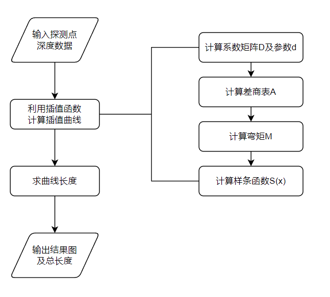

## 1.4 程序代码

```matlab
%导入数据
data_path = 'sea2023.csv';
data = readmatrix(data_path);
x = data(:, 1);
y = data(:, 2);
x0 = 0:0.1:5000;
%利用插值函数计算插值曲线
s = threesimple(x, y, x0);
%求曲线长度
total_length = 0;
for i = 2:length(x0)
    total_length = total_length + sqrt((x0(i) - x0(i-1))^2 + (s(i) - s(i-1))^2);
end
total_length = round(total_length, 1);

function s = threesimple(X, Y, x)
% 边界条件为自然边界条件
% D：系数矩阵
% h：插值宽度
% A：差商表
n = length(X);
A = zeros(n, n);
A(:,1) = Y';
D = zeros(n-2, n-2);
d = zeros(n-2, 1);
for j = 2:n
    for i = j:n
        A(i,j) = (A(i,j-1) - A(i-1,j-1)) / (X(i) - X(i-j+1));
    end
end
for i = 1:n-1
    h(i) = X(i+1) - X(i);
end
for i = 1:n-2
    D(i,i) = 2;
    d(i,1) = (6/(h(i+1)+h(i))) * (A(i+2,2) - A(i+1,2));
end
for i = 2:n-2
    u(i) = h(i) / (h(i) + h(i+1));
    n(i-1) = h(i) / (h(i-1) + h(i));
    D(i-1,i) = n(i-1);
    D(i,i-1) = u(i);
end
M = D \ d;
M = [0; M; 0];
n = length(X);
m = length(x);
for t = 1:m
    for i = 1:n-1
        if (x(t) <= X(i+1)) && (x(t) >= X(i))
            s(t) = M(i,1)*(X(i+1)-x(t))^3/(6*h(i)) + M(i+1,1)*(x(t)-X(i))^3/(6*h(i)) ...
                 + (A(i,1)-M(i,1)/6*(h(i))^2)*(X(i+1)-x(t))/h(i) ...
                 + (A(i+1,1)-M(i+1,1)/6*(h(i))^2)*(x(t)-X(i))/h(i);
            break;
        else
            s(t) = 0;
        end
    end
end
end
```

## 1.5 输入数据

| **序号** | **探测点** | **深度** | **序号** | **探测点** | **深度** |
|:--------:|:----------:|:--------:|:--------:|:----------:|:--------:|
|    1     |     0      |  341.96  |    27    |    2600    |  328.92  |
|    2     |    100     |  311.10  |    28    |    2700    |  314.11  |
|    3     |    200     |  315.74  |    29    |    2800    |  319.84  |
|    4     |    300     |  324.49  |    30    |    2900    |  321.28  |
|    5     |    400     |  321.14  |    31    |    3000    |  333.84  |
|    6     |    500     |  333.09  |    32    |    3100    |  319.68  |
|    7     |    600     |  318.68  |    33    |    3200    |  321.20  |
|    8     |    700     |  338.88  |    34    |    3300    |  320.89  |
|    9     |    800     |  325.66  |    35    |    3400    |  325.90  |
|    10    |    900     |  309.84  |    36    |    3500    |  335.28  |
|    11    |    1000    |  328.62  |    37    |    3600    |  332.00  |
|    12    |    1100    |  321.80  |    38    |    3700    |  324.47  |
|    13    |    1200    |  320.74  |    39    |    3800    |  313.36  |
|    14    |    1300    |  308.30  |    40    |    3900    |  330.60  |
|    15    |    1400    |  328.45  |    41    |    4000    |  322.32  |
|    16    |    1500    |  312.62  |    42    |    4100    |  315.10  |
|    17    |    1600    |  317.83  |    43    |    4200    |  319.89  |
|    18    |    1700    |  327.40  |    44    |    4300    |  316.75  |
|    19    |    1800    |  323.75  |    45    |    4400    |  321.92  |
|    20    |    1900    |  313.48  |    46    |    4500    |  327.64  |
|    21    |    2000    |  316.66  |    47    |    4600    |  320.40  |
|    22    |    2100    |  340.19  |    48    |    4700    |  329.88  |
|    23    |    2200    |  332.40  |    49    |    4800    |  332.00  |
|    24    |    2300    |  319.20  |    50    |    4900    |  344.35  |
|    25    |    2400    |  334.64  |    51    |    5000    |  348.41  |
|    26    |    2500    |  311.43  |          |            |          |

## 1.6 输出结果及分析

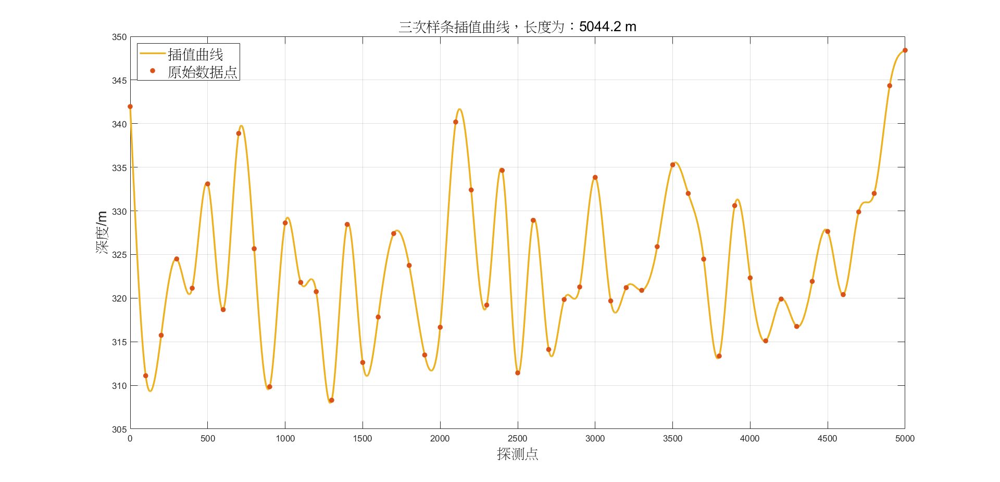

&emsp;&emsp;根据自编写三次样条插值函数的计算，铺设海底光缆的总长度为5044.2m（保留小数点后一位）。将结果与MATLAB中Curve Fitting Toolbox库的csape函数插值结果进行对比，平均相对误差为6.0242e-15%，说明了插值程序的准确性。

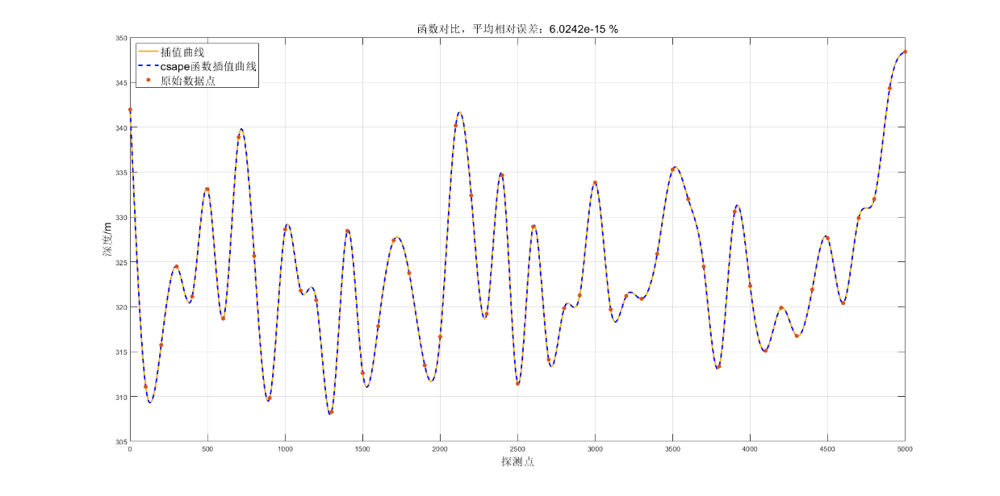

# 2. 粉丝数量分析

## 2.1 题目简介

&emsp;&emsp;8月16日刀郎入驻抖音平台，在无任何作品的情况下5天突破了500万粉丝，引发了极高的关注。附录中给出了近90天中每日的粉丝数据量，可以通过数据拟合就可以知道广大粉丝对刀郎的喜爱程度。请预测一下，在该平台上粉丝数量将会达到多少数量？

## 2.2 题目分析

&emsp;&emsp;本题为拟合预测问题，通过已知数据拟合函数并对未来数据进行预测。拟采用最小二乘拟合出粉丝数量与天数的多种近似函数关系，利用MATLAB编程并对几个函数关系进行误差比较，选取最准确的函数模型进行对未来粉丝数量的预测。

### 2.2.1 四次多项式

&emsp;&emsp;首先采用四次多项式进行函数拟合，函数形式为：

$$
p(x) = c_{0} + c_{1}x + c_{2}x^{2} + c_{3}x^{3} + c_{4}x^{4}
$$

&emsp;&emsp;取 $\phi_{i}(x) = x^{i}\ (i = 0,1,2,3,4)$，则正规方程组可表示为：

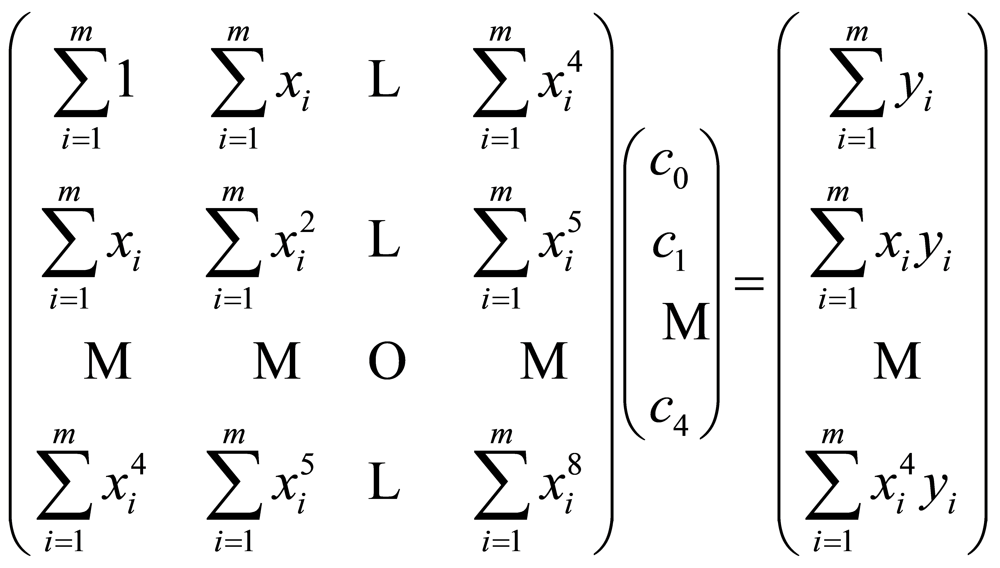

### 2.2.2 四次分段多项式

&emsp;&emsp;采用四次分段多项式进行函数拟合，函数形式与基函数选取同上。将数据按照第10天、第19天，第36天为节点分成四段分别进行拟合。

### 2.2.3 五次多项式

&emsp;&emsp;采用五次多项式进行函数拟合，函数形式为：

$$
p(x) = c_{0} + c_{1}x + c_{2}x^{2} + c_{3}x^{3} + c_{4}x^{4} + c_{5}x^{5}
$$

&emsp;&emsp;取 $\phi_{i}(x) = x^{i}\ (i = 0,1,\cdots,5)$，则正规方程组可表示为：

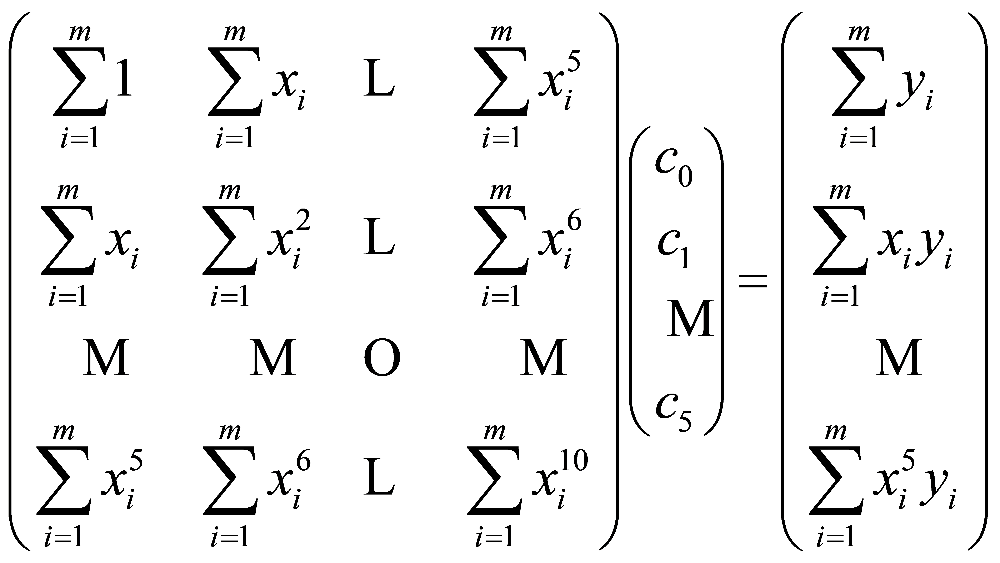

### 2.2.4 指数函数

&emsp;&emsp;根据前92天的粉丝数量，做出如下粉丝数量变化图：

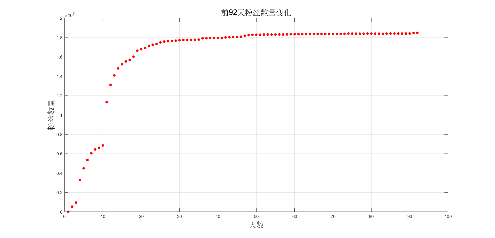

&emsp;&emsp;由图可知，初始几天的粉丝数量增加很快，随后趋于平稳。鉴于指数函数 $y = ae^{b/x}$ 具有这种特征，故取：$z = \ln y \approx \ln a + bx^{-1} = c_{0} + c_{1}x^{-1}$，取 $\phi_{0}(x) = 1,\ \phi_{1}(x) = x^{-1}$，则正规方程组为：

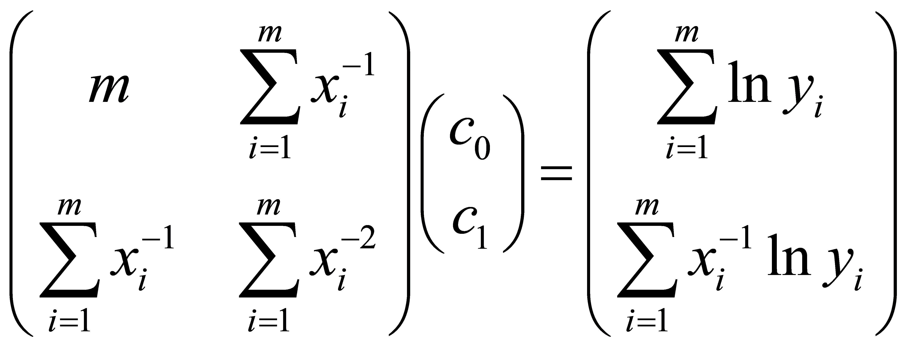

## 2.3 算法流程

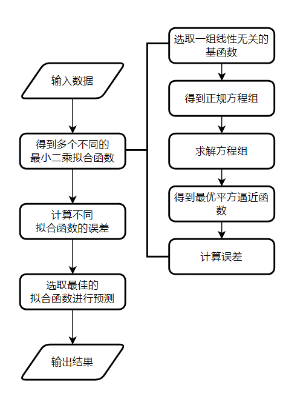

## 2.4 程序代码

```matlab
clear all;
data = xlsread('fans.xlsx');
y = data(:,1);
p = (93:152);
m = length(y);
x = linspace(1, m, m);

%四次多项式
[t_4, mean_error_4, predict_4] = polynomial(4, y, p, 1);

%四次分段多项式
y1 = y(1:10);
y2 = y(10:19);
y3 = y(19:36);
y4 = y(36:92);
[t_4_1, mean_error_4_1, predict_4_1] = polynomial(4, y1, p, 1);
[t_4_2, mean_error_4_2, predict_4_2] = polynomial(4, y2, p, 10);
[t_4_3, mean_error_4_3, predict_4_3] = polynomial(4, y3, p, 19);
[t_4_4, mean_error_4_4, predict_4_4] = polynomial(4, y4, p, 36);
t_p = [t_4_1', t_4_2(2:end)', t_4_3(2:end)', t_4_4(2:end)'];

%五次多项式
[t_5, mean_error_5, predict_5] = polynomial(5, y, p, 1);

%指数函数
[t_e, mean_error_e, predict_e] = exponential(y, p);

function [t, mean_error, predict] = polynomial(n, y, p, o)
n = n + 1;
A = zeros(n);
b = zeros(n, 1);
m = length(y);
x = (o:o+m-1);
for i = 1:n
    for j = 1:n
        A(i,j) = sum(x.^(i+j-2));
    end
    b(i) = sum((x.^(i-1)) * y);
end
c = A \ b;
t = zeros(m, 1);
for i = 1:m
    for j = 1:n
        t(i) = t(i) + c(j) * (x(i)^(j-1));
    end
end
error = abs(t' - y) ./ abs(y);
% 计算平均相对误差
error = error(2:end);
mean_error = mean(error);
q = length(p);
predict = zeros(q, 1);
for i = 1:q
    for j = 1:n
        predict(i) = predict(i) + c(j) * p(i)^(j-1);
    end
end
end

function [t, mean_error, predict] = exponential(y, p)
%指数函数
%%计算正规方程组
n = 2;
A = zeros(n);
b = zeros(n, 1);
m = length(y);
x = linspace(1, m, m);
for i = 1:n
    for j = 1:n
        A(i,j) = sum(x.^(2-i-j));
    end
    b(i) = sum((x.^(1-i)) * log(y));
end
c = A \ b;
t = exp(c(1) + c(2) * x.^(-1));
error = abs(t' - y) ./ abs(y);
error = error(2:end);
mean_error = mean(error);
q = length(p);
predict = zeros(q, 1);
for i = 1:q
    predict(i) = exp(c(1) + c(2) * p(i).^(-1));
end
end
```

## 2.5 输入数据

&emsp;&emsp;输入数据为.xlsx格式文件数据，其中包含每天的粉丝数量以及每天的粉丝变化数量，代码中用到的数据为每天的粉丝数量数据。

| **天数** | **粉丝数量** | **天数** | **粉丝数量** | **天数** | **粉丝数量** | **天数** | **粉丝数量** |
|:--:|:--:|:--:|:--:|:--:|:--:|:--:|:--:|
| 1 | 9070 | 24 | 17318052 | 47 | 18172488 | 70 | 18352505 |
| 2 | 532346 | 25 | 17478284 | 48 | 18231418 | 71 | 18355956 |
| 3 | 956818 | 26 | 17568855 | 49 | 18262702 | 72 | 18358176 |
| 4 | 3283561 | 27 | 17593997 | 50 | 18274481 | 73 | 18367393 |
| 5 | 4490611 | 28 | 17628518 | 51 | 18276241 | 74 | 18389673 |
| 6 | 5345441 | 29 | 17660850 | 52 | 18288609 | 75 | 18388589 |
| 7 | 6044707 | 30 | 17705193 | 53 | 18292345 | 76 | 18384355 |
| 8 | 6432501 | 31 | 17727632 | 54 | 18292396 | 77 | 18382030 |
| 9 | 6613443 | 32 | 17741979 | 55 | 18291409 | 78 | 18383631 |
| 10 | 6848090 | 33 | 17746479 | 56 | 18296106 | 79 | 18386189 |
| 11 | 11320033 | 34 | 17753725 | 57 | 18293629 | 80 | 18387207 |
| 12 | 13094392 | 35 | 17768630 | 58 | 18299746 | 81 | 18385835 |
| 13 | 14077838 | 36 | 17908767 | 59 | 18324355 | 82 | 18383338 |
| 14 | 14796441 | 37 | 17919965 | 60 | 18327146 | 83 | 18376202 |
| 15 | 15224449 | 38 | 17922083 | 61 | 18332721 | 84 | 18385698 |
| 16 | 15515560 | 39 | 17929209 | 62 | 18332970 | 85 | 18388317 |
| 17 | 15675065 | 40 | 17936294 | 63 | 18334657 | 86 | 18392935 |
| 18 | 16009874 | 41 | 17935031 | 64 | 18334812 | 87 | 18392902 |
| 19 | 16625986 | 42 | 17990118 | 65 | 18342868 | 88 | 18392344 |
| 20 | 16776186 | 43 | 18013379 | 66 | 18344525 | 89 | 18392056 |
| 21 | 16885778 | 44 | 18023975 | 67 | 18350676 | 90 | 18393046 |
| 22 | 17097632 | 45 | 18037221 | 68 | 18349742 | 91 | 18462936 |
| 23 | 17236371 | 46 | 18068263 | 69 | 18349485 | 92 | 18472166 |

## 2.6 输出结果及分析

&emsp;&emsp;四种不同函数的拟合效果如下图：

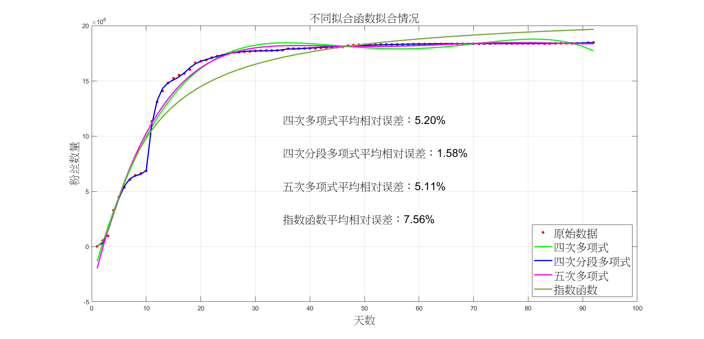

&emsp;&emsp;通过拟合结果可以看到，四个拟合函数的平均相对误差分别为：5.20%、1.58%、5.11%、7.56%。舍弃掉误差最大的四次多项式，接下来对剩余三个函数模型进行预测方面的对比：

### 2.6.1 四次多项式

&emsp;&emsp;得到最终的四次多项式为：

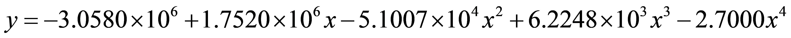

&emsp;&emsp;用此函数进行未来粉丝数量的预测至第120天：

| **天数** | **数量/10<sup>7</sup>** | **天数** | **数量/10<sup>7</sup>** |
|:--------:|:-----------------------:|:--------:|:-----------------------:|
|    93    |         1.7453          |   107    |         0.9230          |
|    94    |         1.7169          |   108    |         0.8197          |
|    95    |         1.6849          |   109    |         0.7088          |
|    96    |         1.6490          |   110    |         0.5901          |
|    97    |         1.6089          |   111    |         0.4632          |
|    98    |         1.5644          |   112    |         0.3278          |
|    99    |         1.5153          |   113    |         0.1834          |
|   100    |         1.4614          |   114    |         0.0299          |
|   101    |         1.4022          |   115    |         -0.1332         |
|   102    |         1.3376          |   116    |         -0.3063         |
|   103    |         1.2673          |   117    |         -0.4897         |
|   104    |         1.1910          |   118    |         -0.6837         |
|   105    |         1.1084          |   119    |         -0.8889         |
|   106    |         1.0192          |   120    |         -1.1055         |

### 2.6.2 四次分段多项式

&emsp;&emsp;得到最终的分段四次多项式为：

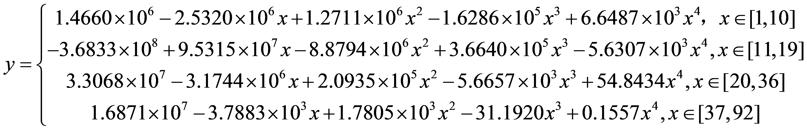

&emsp;&emsp;用此函数进行未来至第120天的预测：

| **天数** | **数量/10<sup>7</sup>** | **天数** | **数量/10<sup>7</sup>** |
|:--------:|:-----------------------:|:--------:|:-----------------------:|
|    93    |         1.8476          |   107    |         1.9048          |
|    94    |         1.8496          |   108    |         1.9119          |
|    95    |         1.8519          |   109    |         1.9195          |
|    96    |         1.8544          |   110    |         1.9277          |
|    97    |         1.8572          |   111    |         1.9365          |
|    98    |         1.8603          |   112    |         1.9458          |
|    99    |         1.8637          |   113    |         1.9557          |
|   100    |         1.8675          |   114    |         1.9662          |
|   101    |         1.8716          |   115    |         1.9774          |
|   102    |         1.8761          |   116    |         1.9893          |
|   103    |         1.8810          |   117    |         2.0019          |
|   104    |         1.8862          |   118    |         2.0152          |
|   105    |         1.8920          |   119    |         2.0292          |
|   106    |         1.8981          |   120    |         2.0441          |

### 2.6.3 五次多项式

&emsp;&emsp;得到最终的五次多项式为：

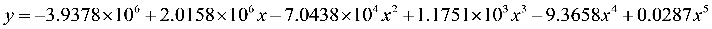

&emsp;&emsp;用此函数进行预测至第120天：

| **天数** | **数量/10<sup>7</sup>** | **天数** | **数量/10<sup>7</sup>** |
|:--------:|:-----------------------:|:--------:|:-----------------------:|
|    93    |          1.832          |   107    |          1.925          |
|    94    |          1.832          |   108    |          1.946          |
|    95    |          1.832          |   109    |          1.971          |
|    96    |          1.832          |   110    |          1.999          |
|    97    |          1.834          |   111    |          2.030          |
|    98    |          1.836          |   112    |          2.066          |
|    99    |          1.839          |   113    |          2.107          |
|   100    |          1.844          |   114    |          2.152          |
|   101    |          1.850          |   115    |          2.202          |
|   102    |          1.857          |   116    |          2.258          |
|   103    |          1.866          |   117    |          2.320          |
|   104    |          1.877          |   118    |          2.388          |
|   105    |          1.891          |   119    |          2.463          |
|   106    |          1.907          |   120    |          2.546          |

### 2.6.4 指数函数

&emsp;&emsp;得到最终的指数函数式为：

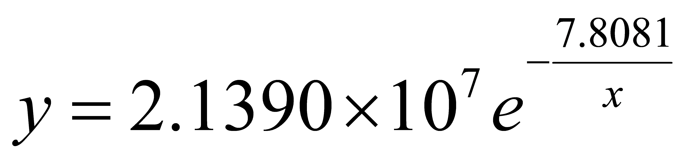

&emsp;&emsp;利用指数函数来预测至第120天的粉丝数量如下：

| **天数** | **数量/10<sup>7</sup>** | **天数** | **数量/10<sup>7</sup>** |
|:--------:|:-----------------------:|:--------:|:-----------------------:|
|    93    |         1.9667          |   107    |         1.9884          |
|    94    |         1.9685          |   108    |         1.9898          |
|    95    |         1.9702          |   109    |         1.9911          |
|    96    |         1.9719          |   110    |         1.9924          |
|    97    |         1.9735          |   111    |         1.9937          |
|    98    |         1.9752          |   112    |         1.9949          |
|    99    |         1.9767          |   113    |         1.9962          |
|   100    |         1.9783          |   114    |         1.9974          |
|   101    |         1.9798          |   115    |         1.9986          |
|   102    |         1.9813          |   116    |         1.9997          |
|   103    |         1.9828          |   117    |         2.0009          |
|   104    |         1.9843          |   118    |          2.002          |
|   105    |         1.9857          |   119    |         2.0031          |
|   106    |         1.9871          |   120    |         2.0042          |

### 2.6.5 模型对比

&emsp;&emsp;将四个函数模型进行对比：

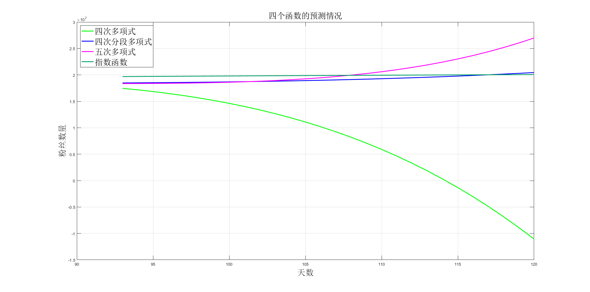

&emsp;&emsp;首先可以看到四次函数模型在第115天开始出现负值，不符合客观现实，故预测时不采用这个函数模型。五次多项式所预测的粉丝数量同样在115天左右开始激增，这是不符合正常情况的。因为根据之前的经验，刀郎在出新歌前后的粉丝增长数量（除去刚开始的几天）均没有非常大的增长，因此这个函数模型在此之后的预测结果不可信。

&emsp;&emsp;因此对于剩下两个函数模型进行分析。目前已获得的刀郎粉丝数量变化至12月13日变化如下：

| **天数** | **数量/10<sup>7</sup>** | **天数** | **数量/10<sup>7</sup>** |
|:--------:|:-----------------------:|:--------:|:-----------------------:|
|    93    |         1.8471          |   107    |         1.8424          |
|    94    |         1.8469          |   108    |         1.8419          |
|    95    |         1.8465          |   109    |         1.8411          |
|    96    |         1.8462          |   110    |         1.8406          |
|    97    |         1.8462          |   111    |         1.8400          |
|    98    |         1.8461          |   112    |         1.8394          |
|    99    |         1.8455          |   113    |         1.8387          |
|   100    |         1.8452          |   114    |         1.8500          |
|   101    |         1.8452          |   115    |         1.8537          |
|   102    |         1.8446          |   116    |         1.8548          |
|   103    |         1.8441          |   117    |         1.8546          |
|   104    |         1.8435          |   118    |         1.8544          |
|   105    |         1.8432          |   119    |         1.8544          |
|   106    |         1.8429          |   120    |         1.8544          |

&emsp;&emsp;将现实粉丝数据与剩下三个函数模型进行对比：

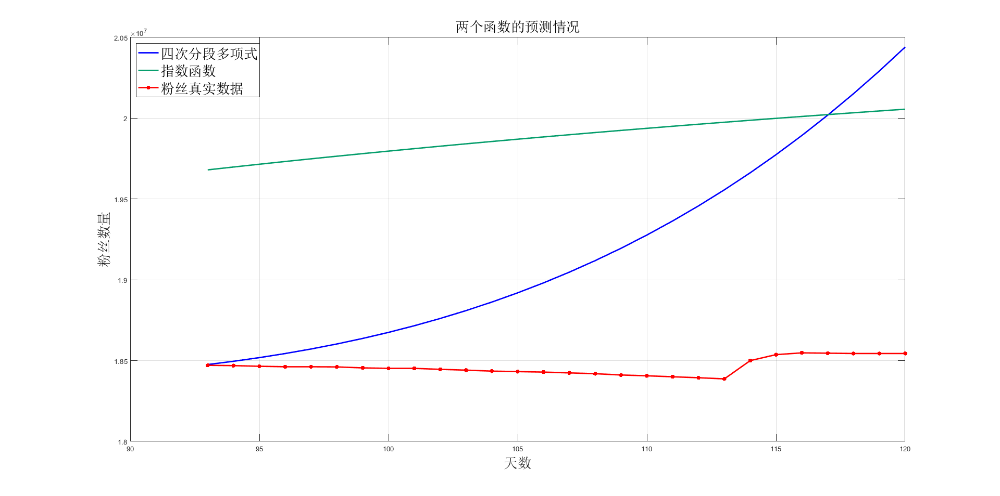

&emsp;&emsp;通过曲线可以看到，虽然分段四次多项式拟合函数在前92天的拟合效果非常好，但是在预测情况上与真实数据有着较大的差异，同时随着天数的增加，预测的误差逐步增大。而指数函数虽然与真实数据的差距比较大，但是其趋势与真实数据差别不大，故对指数函数模型进行修正，求得最小相对误差时的常数项为：$-1.462 \times 10^{7}$。

&emsp;&emsp;修正后的函数模型为：

$$
y = 2.1390 \times 10^{7} e^{-\frac{7.8081}{x}} - 1.462 \times 10^{7}
$$

&emsp;&emsp;此时相对误差最小为：0.44%，如图所示：

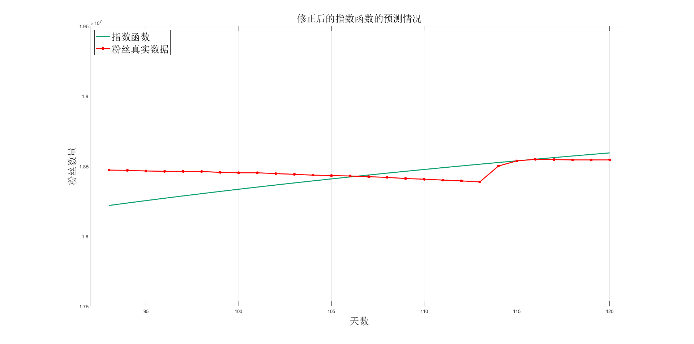

&emsp;&emsp;可以明显地看到指数函数模型的预测结果是符合实际情况的，因此得出如下结论：

1. 在前92天时，四次分段多项式函数的拟合效果最好，可以用这个函数模型来近似描述前92天的粉丝数量变化；

2. 指数函数模型的预测效果最好，通过修正后的指数函数模型的预测误差低至0.44%。

# 3. 大规模稀疏线性方程组的求解

## 3.1 题目简介

&emsp;&emsp;在大数据应用分析以及深度学习中，大规模稀疏线性方程组的求解问题日益普遍。

&emsp;&emsp;线性方程组求解方法一般是以高斯消去法、列主元高斯消去法、迭代法为主。当线性方程组中的系数矩阵是严格对角占优矩阵时，直接使用高斯消去法就可以得到比较准确的解。

&emsp;&emsp;在实际使用中，各个功能模块之间的数据传递可以通过数据文件实现。假设前端应用程序模块产生的高阶线性方程组都是带状方程组，并且满足严格对角占优，其系数矩阵和右端常量的数据都存放于二进制数据文件中，计算模块读取这些数据文件，并从中获得系数矩阵和右端常量，然后使用高斯消去法进行求解。

&emsp;&emsp;本例中的数据文件均为二进制文件形式，其存贮效率和读写效率更高。本题数据文件共有5个，并且各数据文件中的系数矩阵均为严格对角占优的带状矩阵：

&emsp;&emsp;（1）试编写一个统一的程序，实现从前4个数据文件中读入方程组的数据，再使用高斯消去法进行求解。第5个数据文件仅作为进行程序测试的扩展适应性功能所用，不作为基本要求。

&emsp;&emsp;（2）针对本专业中所碰到的实际问题，提炼一个使用方程组进行求解的例子，并对求解过程进行分析、求解。

## 3.2 题目分析

&emsp;&emsp;本题目的为编写程序解方程，即对高斯消去法的编程实现。首先通过对文件的读取判断矩阵为压缩形式还是非压缩形式，然后读取矩阵的阶数，上下带宽等相关参数，最后利用高斯消去法对矩阵进行求解，并对结果进行讨论分析。

&emsp;&emsp;针对本专业的实际问题在此选择经典的数值传热问题，并采用高斯消元法、Jacobi迭代法和G-S迭代法进行求解，对三种方法进行编程实现。

&emsp;&emsp;图中为一正方形导热物体，各边的温度如图所示，导热物体无内热源，物性为常数，求中间四个点的温度。

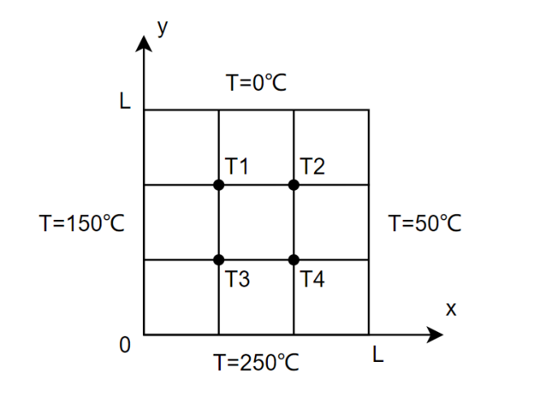

&emsp;&emsp;根据导热方程建立方程组如下：

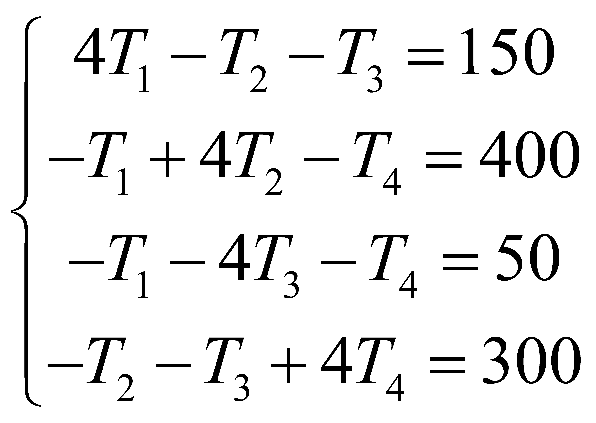

## 3.3 算法流程

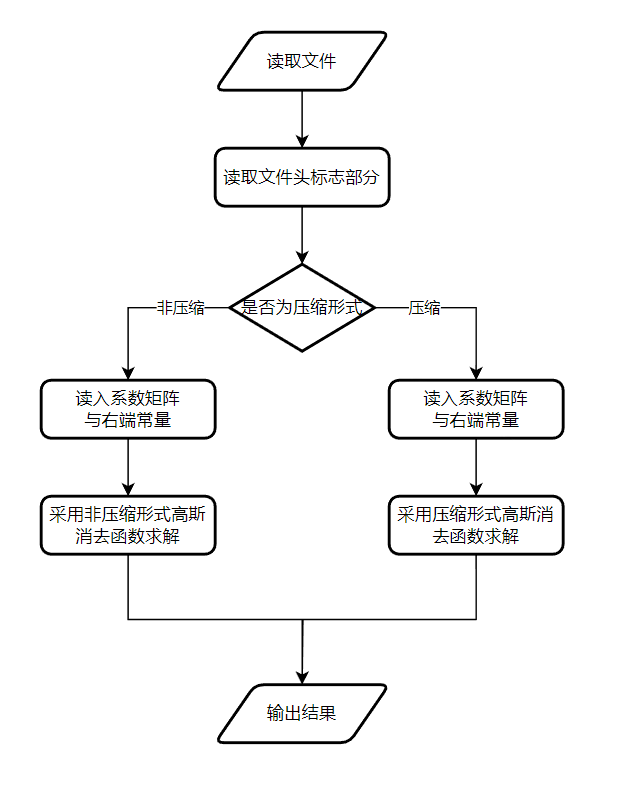

## 3.4 输入数据

&emsp;&emsp;本题数据文件共有5个，其说明如下表所示，并且各数据文件中的系数矩阵均为严格对角占优的带状矩阵：

| **序号** | **数据文件**  |  **规模**   |  **类型**  | **解** |   **说明**   |
|:--------:|:-------------:|:-----------:|:----------:|:------:|:------------:|
|    1     | data20231.dat |    10阶     | 非压缩格式 |  3.14  | 用于测试程序 |
|    2     | data20232.dat |    10阶     |  压缩格式  |  3.14  | 用于测试程序 |
|    3     | data20233.dat | 1000阶左右  | 非压缩格式 |  待解  | 用于程序求解 |
|    4     | data20234.dat | 40000阶左右 |  压缩格式  |  待解  | 用于程序求解 |
|    5     | data20235.dat |  13w阶左右  |  压缩格式  |  待解  | 测试程序功能 |

## 3.5 程序代码

### 3.5.1 统一编程求解五个文件的方程

```matlab
Solve('data20231.dat');

function SolveFunction1(n, p, q)
% 按非压缩格式求解方程
fprintf('非压缩格式求解方程\n');
A = zeros(n, n);
B = zeros(n, 1);
fprintf('读入所有的系数矩阵\n');
for i = 1:n
    for j = 1:n
        A(i, j) = fread(f, 1, 'float32');
    end
end
fprintf('读入右端常量\n');
for i = 1:n
    B(i) = fread(f, 1, 'float32');
end
x = Gauss1(A, B, n, p, q); % 利用带状矩阵特征的高斯消去法求解
nn = min(30, n);
for i = 1:nn
    fprintf('x[%d]=%.3f\n', i - 1, x(i));
end
end

function SolveFunction2(n, p, q)
% 按压缩格式求解方程
fprintf('压缩格式求解方程\n');
A = zeros(n, p + q + 1);
B = zeros(n, 1);
fprintf('读入所有的系数矩阵\n');
for i = 1:n
    for j = 1:(p + q + 1)
        A(i, j) = fread(f, 1, 'float32');
    end
end
fprintf('读入右端常量\n');
for i = 1:n
    B(i) = fread(f, 1, 'float32');
end
x = Gauss2(A, B, n, p, q); % 压缩格式高斯消去法求解
nn = min(30, n);
for i = 1:nn
    fprintf('x[%d]=%.3f\n', i - 1, x(i));
end
end

function res = Gauss1(A, B, n, p, q)
% 使用简单高斯消去法计算矩阵
fprintf('正在消去:\n');
for i = 1:n
    if A(i, i) == 0
        fprintf('Error!\n');
        return;
    end
    LastRow = min(i + p + 1, n);
    for j = (i + 1):LastRow
        l = A(j, i) / A(i, i);
        LastCol = min(i + q + 1, n);
        for k = (i + 1):LastCol
            A(j, k) = A(j, k) - A(i, k) * l;
        end
        B(j) = B(j) - B(i) * l;
    end
end
fprintf('正在回代求解:\n');
res = zeros(n, 1);
res(n) = B(n) / A(n, n);
for i = (n - 1):-1:1
    S = B(i);
    LastCol = min(i + q + 1, n);
    for j = (i + 1):LastCol
        S = S - A(i, j) * res(j);
    end
    res(i) = S / A(i, i);
end
end

function res = Gauss2(A, B, n, p, q)
% 压缩格式高斯消去法
fprintf('正在消去:\n');
for i = 1:n
    if A(i, i) == 0
        fprintf('Error!\n');
        return;
    end
    LastRow = i + p + 1;
    if LastRow > n
        LastRow = n;
    end
    for j = (i + 1):LastRow
        l = A(j, i) / A(i, i);
        LastCol = i + q + 1;
        if LastCol > n
            LastCol = n;
        end
        for k = (i + 1):LastCol
            ajk = A(j, k) - A(i, k) * l;
            A(j, k) = ajk;
        end
        B(j) = B(j) - B(i) * l;
    end
end
fprintf('正在回代求解:\n');
res = zeros(n, 1);
res(n) = B(n) / A(n, n);
for i = (n - 1):-1:1
    S = B(i);
    LastCol = i + q + 1;
    if LastCol > n
        LastCol = n;
    end
    for j = (i + 1):LastCol
        S = S - A(i, j) * res(j);
    end
    res(i) = S / A(i, i);
end
end

function data = ReadDataFile(fileName)
f = fopen(fileName, 'rb');
% 检查文件是否成功打开
if f == -1
    error('无法打开文件');
end
data = fread(f, 3, 'uint32', 'ieee-le');
% 关闭文件
fclose(f);
end

function Solve(fileName)
% 按非压缩格式求解方程的包装函数
data = ReadDataFile(fileName);
% 读入文件头标志部分
n = data(1);
q = data(2);
p = data(3);
% 读入系数矩阵结构信息
fprintf('阶数: %d 上带宽: %d 下带宽: %d\n', n, q, p);
StartTime = tic;
fprintf('开始求解方程组,起始时间:%s\n', datestr(datetime('now'), 'yyyy-mm-dd HH:MM:SS'));
if q == 0x102
    SolveFunction1(n, p, q); % 按非压缩格式求解方程
else
    SolveFunction2(n, p, q); % 按压缩格式求解方程
end
EndTime = toc(StartTime);
fprintf('用时:%d ms\n', round(EndTime * 1000));
fclose(f);
end
```

### 3.5.2 专业问题：数值传热问题

```matlab
A = [4,-1,-1,0; -1,4,0,-1; -1,0,4,-1; 0,-1,-1,4];
B = [150; 400; 50; 300];
n = 4;
output_Gauss = Gauss(A, B, n);
output_Jacobi = Jacobi(A, B);
output_GS = GS(A, B);

function res = Gauss(A, B, n)
% 使用简单高斯消去法计算矩阵
fprintf('正在消去:\n');
for i = 1:n
    fprintf('消去第%d 列\n', i);
    if A(i, i) == 0
        fprintf('Error!\n');
        return;
    end
    for j = (i + 1):n
        l = A(j, i) / A(i, i);
        for k = (i + 1):n
            A(j, k) = A(j, k) - A(i, k) * l;
        end
        B(j) = B(j) - B(i) * l;
    end
end
fprintf('正在回代求解:\n');
res = zeros(n, 1);
res(n) = B(n) / A(n, n);
for i = (n - 1):-1:1
    S = B(i);
    for j = (i + 1):n
        S = S - A(i, j) * res(j);
    end
    res(i) = S / A(i, i);
end
end

function res = Jacobi(A, B)
%Jacobi点迭代法
inum = 30; %最大迭代次数
res = zeros(size(A,2), inum+1);
for i = 2:inum+1
    for j = 1:size(A,2)
        res(j,i) = (B(j) - sum(A(j,:).*res(:,i-1)') + A(j,j)*res(j,i-1)) / A(j,j);
    end
end
end

function res = GS(A, B)
inum = 30;
res = zeros(size(A,2), inum+1);
%G-S点迭代法
for i = 2:inum+1
    for j = 1:size(A,2)
        if j == 1
            res(j,i) = (B(j) - sum(A(j,2:end).*res(2:end,i-1)')) / A(j,j);
        elseif j == size(A,2)
            res(j,i) = (B(j) - sum(A(j,1:j-1).*res(1:j-1,i)')) / A(j,j);
        else
            res(j,i) = (B(j) - sum(A(j,1:j-1).*res(1:j-1,i)') - sum(A(j,j+1:end).*res(j+1:end,i-1)')) / A(j,j);
        end
    end
end
end
```

## 3.6 输出结果及分析

### 3.6.1 统一编程求解五个文件的方程

&emsp;&emsp;经过统一编程的求解结果如下表：

| **序号** | **数据文件** | **阶数n** | **上带宽q** | **下带宽p** | **类型** | **解** | **求解时间/ms** |
|:--:|:--:|:--:|:--:|:--:|:--:|:--:|:--:|
| 1 | data20231.dat | 10 | 3 | 3 | 非压缩格式 | 3.14 | — |
| 2 | data20232.dat | 10 | 3 | 3 | 压缩格式 | 3.14 | — |
| 3 | data20233.dat | 1024 | 4 | 4 | 非压缩格式 | 2.078 | 745 |
| 4 | data20234.dat | 40960 | 5 | 5 | 压缩格式 | 2.077 | 2013 |
| 5 | data20235.dat | 131400 | 5 | 5 | 压缩格式 | 1.314 | 6448 |

### 3.6.2 专业问题：数值传热

&emsp;&emsp;最终结果如下表：

| **点** | **温度/℃** |
|:--:|:--:|
| $T_1$ | 93.7500 |
| $T_2$ | 156.2500 |
| $T_3$ | 68.7500 |
| $T_4$ | 131.2500 |

&emsp;&emsp;下两图展示了Jacobi迭代法与G-S迭代法的迭代过程：

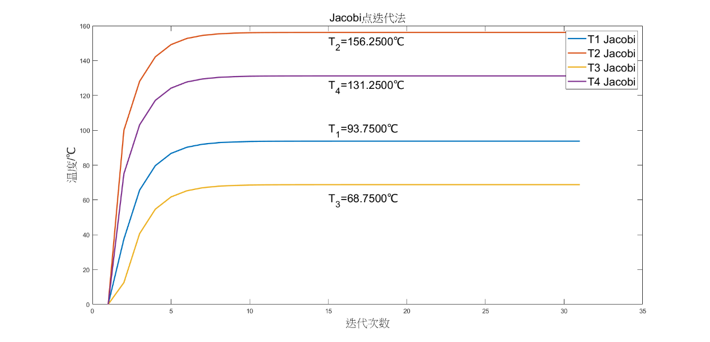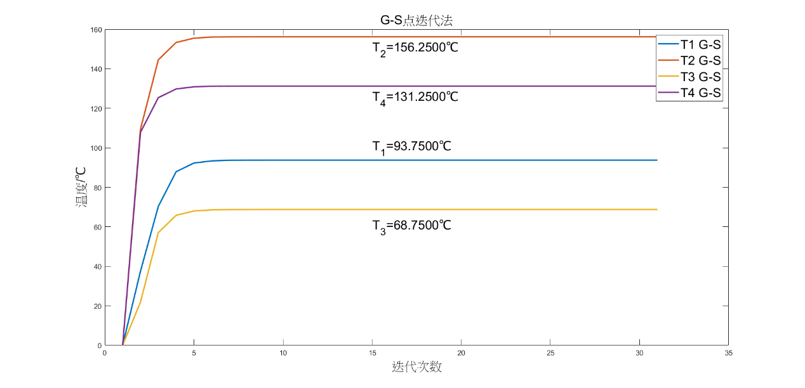

&emsp;&emsp;通过本题，对于高斯消元法的编程实现有了更深的认识，提升了代码编写能力。同时对于高斯消元法的过程有了更深的了解。同时可以看到对于最终结果，高斯消元法在面对高阶矩阵时求解过程会变得缓慢，也说明了基本高斯消元法在面对复杂方程组时的劣势所在。
